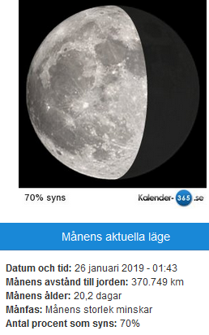

Idag går solen upp 08:08 och ned 16:19 Dagens längd är 8 timmar och 11 minuter. Det är gryning 07:25 och skymning 17:02 Det är dagsljus 9 timmar och 37 minuter. Månen går upp 23:51 och ned 10:35 Månen är belyst 70 %.

 Molnigt - 5,4 C  Vindby 0,3 m/s NW  Luftfuktighet 62 %  hPa 1002 Kl.02:40

 Molnigt - 5,4 C  Vindby 0,8 m/s N  Luftfuktighet 61 %  hPa 999 Kl.06:20

 Molnigt - 2,7 C  Vindby 1,6 m/s NE  Luftfuktighet 67 %  hPa 998 Kl.13:55

 Molnigt - 4,1 C  Vindby 1,6 m/s E  Luftfuktighet 69 %  hPa 997 Kl.19:50

 Grått och kallt och oväder på väg.

Högst och lägst uppmätta temperatur igår (inofficiellt privat mätare) Max - 1,4 C , Min – 5,1 C Högst uppmätta vind 2,4 m/s, Högst uppmätta vindby 5 m/s

Högst och lägst uppmätta temperatur igår (officiellt enligt [YR.NO](http://www.vackertvader.se/v%C3%A4derstation/karlshamn?utm_source=email&utm_medium=email&utm_campaign=asarum)) Max - 2,3 C, Min – 4,3 C Högst uppmätta vind 3,7 m/s. Högst uppmätta vindby 7,9 m/s

**Tillbaka igen efter ett ofrivilligt uppehåll!**

Efter ett ofrivilligt uppehåll i bloggen är jag tillbaks igen. Jag fick mitt mail kapat och sålt till en liga som utpressar folk över hela världen genom att skicka ett mail från ens eget mail där de hotar att skicka påstådda porrfilmer som man själv ska vara med i till alla ens kontakter om man inte betalar den summa de begär, i mitt fall 650 euro enligt det första mailet och 888 dollar enligt det andra. De har dessutom placerat en så kallad keylogger på min dator som gör att de kan se alla mina tangenttryck och på så vis har de lyckats ta reda på en del av mina lösenord. Även om jag vet att jag aldrig varit inne på porrsidor och definitivt inte varit med själv i någon sådan film som de påstår att jag skulle filmat från min webbkamera, jag har inte ens en webbkamera, så är det fruktansvärt otäckt att veta att någon varit inne i min dator och att de har haft tillgång till alla mina mail och kontakter. Jag har fått tömma min dator helt ( inte jag men mina söner som kan sånt här ) och installerat om allt och byta alla mina lösenord och skaffa tvåstegsverifikation som gör att jag får ett meddelande om någon försöker logga in från någon annan enhet. Dessa kriminella ligor sitter utspridda i olika länder och använder ett så kallat vpn som gör att de kan få det att se ut som att de sitter någon helt annanstans än de verkligen gör. Det gör att det är väldigt svårt att spåra dem. Så om ni skulle få ett sådant mail så ta det på allvar och se till att ni får hjälp av någon som kan sånt här. Dessa mail fastnade i skräpposten hos mig vilket gjorde att jag aldrig sett dem om jag inte kollade där som jag alltid gör. Så tänk på att kolla skräpposten varje dag. På vår USA resa i somras lärde vi känna en kvinna från Australien som vi hållit kontakten med och även hon har råkat ut för den här ligan och fått göra samma procedur som jag med allt jobb det innebär. Det är så sorgligt att dessa människor använder de enorma kunskaper de har till något så vidrigt som det här!
