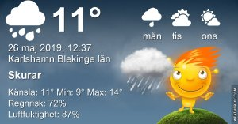

Idag går solen upp 04:29 och ned 21:27 Dagens längd är 16 timmar och 58 minuter. Det är gryning 03:34 och skymning 22:23 Det är dagsljus 18 timmar och 49 minuter. Månen går upp 02:36 och ned 11:33 Månen är belyst 57 %

 

Molnigt 9,8 C  Vindby 4 m/s NNW  Luftfuktighet 72 %  hPa 1004 Kl.01:30

 Molnigt 9,2 C  Vindby 3,8 m/s W  Luftfuktighet 75 %  hPa 1002 Kl.05:45

 Molnigt 14,4 C  Vindby 4,8 m/s NW  Luftfuktighet 88 %  hPa 999 Kl.13:25

 Molnigt 13,4 C  Vindby 3,8 m/s S  Luftfuktighet 57 %  hPa 1000 Kl.19:50

 Något regn kom inte men däremot var det blåsigt och en och annan solglimt idag.

Högst och lägst uppmätta temperatur igår (inofficiellt privat mätare) Max 24,5 ( i solen ) , Min 5,9 C Högst uppmätta vind 3,1 m/s, Högst uppmätta vindby 5,1 m/s

Högst och lägst uppmätta temperatur igår (officiellt enligt [YR.NO](http://www.vackertvader.se/v%C3%A4derstation/karlshamn?utm_source=email&utm_medium=email&utm_campaign=asarum)) Max 18,3 C, Min 7,4 C Högst uppmätta vind 3,5 m/s. Högst uppmätta vindby 9,9 m/s

 

## _**Monument Valley Arizona**_

\[gallery type="rectangular" link="file" size="large" ids="29265,29266,29267,29268,29269,29270,29271,29273,29274,29275,29276,29277,29278,29279,29280,29281,29282,29283,29285,29286,29287,29288,29289,29290,29291,29292,29293,29294,29295,29296,29297,29298,29299,29300,29301,29302,29303,29304,29305,29306,29307,29308,29309,29310,29311,29312,29313,29314,29315,29316,29317,29318,29319,29320,29321,29322,29323,29324,29325,29326,29327,29328"\]

Det blir ett långt inlägg med många bilder som får tala för sig själv idag. Vi tillbringade många timmar här och blev bjudna på grillat som indianerna hade ordnat åt oss. Vi blev också underhållna med klassisk indianmusik. De gjorde det här till en oförglömlig upplevelse.
