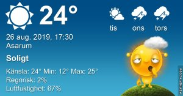

## Måndag 26 augusti

I dag gryr dagen i Asarum 05:11. Solen går upp klockan 05:52 och ner klockan 20:12 . Det mörknar vid 20:52. Dagens längd är 14 timmar och 20 minuter. Det är dagsljus 15 timmar och 41 minuter. Månen går upp 00:32 och ned 17:52 Månen är belyst 26 %

I Asarum blir dagen 4 minuter och 34 sekunder kortare. Dagen har blivit 3 timmar och 20 minuter kortare sedan sommarsolståndet. Vintersolstånd om 118 dagar.

Missa inte gyllene timmen som börjar klockan 19:24 i Asarum. Då står solen lågt och kastar ett fint gyllene ljus.

 

 Mest klart 12 C  Vindby 0,3 m/s N  Luftfuktighet 98 %  hPa 1020 Kl.02:05

 Halvklart 13,3 C  Vindby 0,7 m/s NW  Luftfuktighet 98 %  hPa 1020 Kl.07:10

 Mest klart 29,8 C  Vindby 1,8 m/s SE  Luftfuktighet 51 %  hPa 1020 Kl.13:50

 Halvklart 16,8 C  Vindstilla  Luftfuktighet 71 %  hPa 1018 Kl.20:25

Usch vad varmt det är igen! Och det ska fortsätta åtminstone en dag till!

Högst och lägst uppmätta temperatur igår (inofficiellt privat mätare) Max 32,1 ( i solen ) , Min 10,3 C Högst uppmätta vind 3,4 m/s, Högst uppmätta vindby 5,8 m/s

Högst och lägst uppmätta temperatur igår (officiellt enligt [YR.NO](http://www.vackertvader.se/v%C3%A4derstation/karlshamn?utm_source=email&utm_medium=email&utm_campaign=asarum)) Max 23,3 C, Min 10 C Högst uppmätta vind 3,9 m/s. Högst uppmätta vindby 7,9 m/s

## _**Familjen Svan tar en tidig morgonsimtur

**_

\[gallery type="rectangular" link="file" size="large" ids="31407,31408,31409,31410,31411,31412,31413,31414,31415,31416,31417,31418"\]
