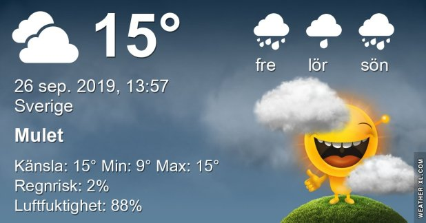

## Torsdag 26 September

I dag gryr dagen i Asarum 06:15. Solen går upp klockan 06:53 och ner klockan 18:50 . Det mörknar vid 19:27. Dagens längd är 11 timmar och 57 minuter. Det är dagsljus 13 timmar och 12 minuter. Månen går upp 03:04 och ned 18:27 Månen är belyst 11 %

I Asarum blir dagen 4 minuter och 39 sekunder kortare. Dagen har blivit 5 timmar och 43 minuter kortare sedan sommarsolståndet. Vintersolstånd om 87 dagar.

Missa inte gyllene timmen som börjar klockan 18:03 i Asarum. Då står solen lågt och kastar ett fint gyllene ljus

 

 Molnigt 10 C  Vindby 1 m/s W  Luftfuktighet 91 %  hPa 1005 Kl.01:40

 Molnigt 10,2 C  Vindby 2,2 m/s S  Luftfuktighet 95 %  hPa 1007 Kl.07:55

 Tunna höga slöjmoln 22,3 C  Vindby 2,8 m/s N  Luftfuktighet 52 %  hPa 1008 Kl.13:30

 Mest molnigt 9,9 C  Vindby 1,6 m/s E  Luftfuktighet 93 %  hPa 1009 Kl.20:30

 Idag har det varit en jättefin dag med sol och lagom varmt!

 

Högst och lägst uppmätta temperatur igår (inofficiellt privat mätare) Max 18,4, Min 10,6 C Högst uppmätta vind 2,4 m/s, Högst uppmätta vindby 4,1 m/s

Högst och lägst uppmätta temperatur igår (officiellt enligt [YR.NO](http://www.vackertvader.se/v%C3%A4derstation/karlshamn?utm_source=email&utm_medium=email&utm_campaign=asarum)) Max 16,4 C, Min 11,1 C Högst uppmätta vind 2,9 m/s. Högst uppmätta vindby 7,7 m/s

 

## _**Herregud & Co del 3**_

\[gallery type="rectangular" link="file" size="large" ids="32017,32018,32019,32020,32021,32022,32023,32024,32025,32026,32027,32028,32029,32030,32031,32032,32033"\]
