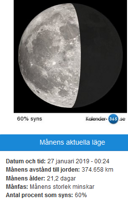
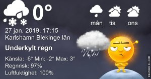
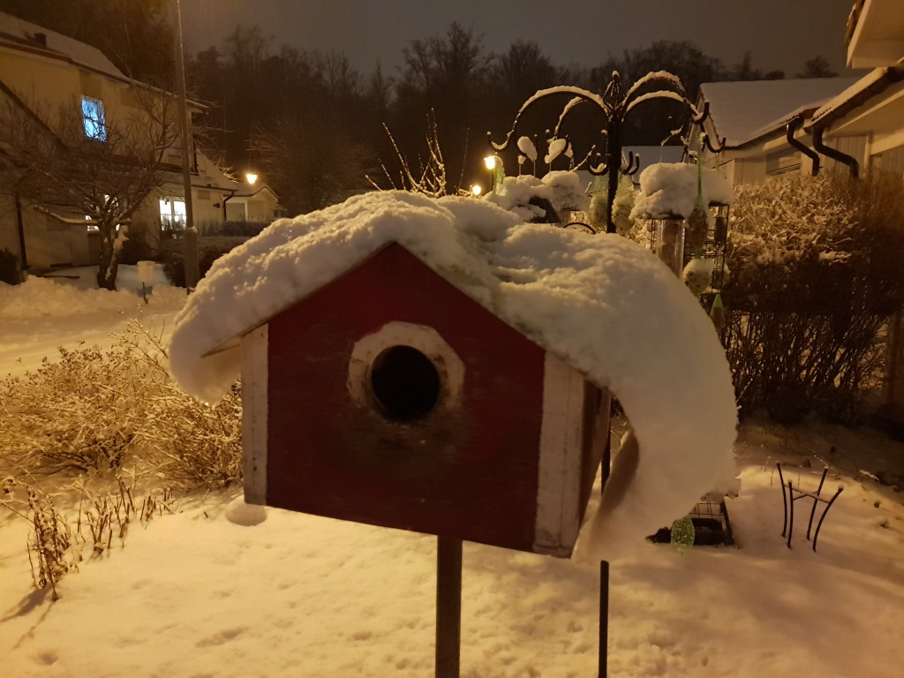
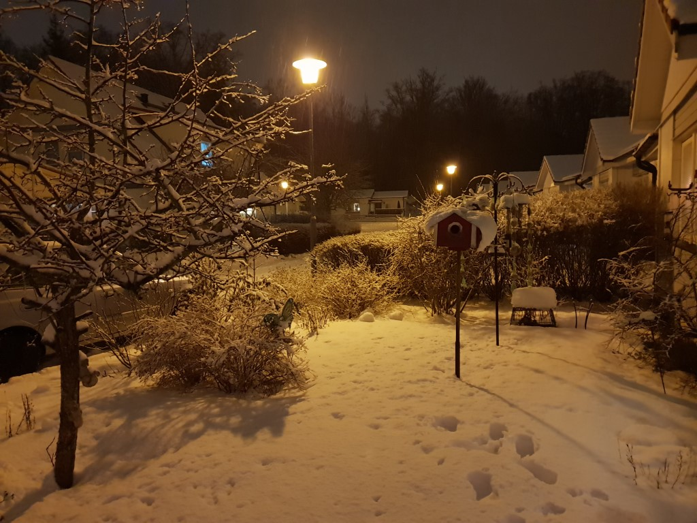

Idag går solen upp 08:05 och ned 16:21 Dagens längd är 8 timmar och 15 minuter. Det är gryning 07:23 och skymning 17:04 Det är dagsljus 9 timmar och 41 minuter. Månen går upp 23:47 och ned 10:56 Månen är belyst 60 %.

 Molnigt - 1,8 C  Vindby 3,4 m/s WSW  Luftfuktighet 68 %  hPa 995 Kl.01:30

 Snö - 0,6 C  Vindby 3,7 m/s NW  Luftfuktighet 86 %  hPa 990 Kl.07:00

 Snö 0,9 C  Vindby 3 m/s WNW  Luftfuktighet 89 %  hPa 986  Snödjup 8,5 mm Kl.13:05

 Molnigt - 0,4 C  Vindby 1,6 m/s NE  Luftfuktighet 89 %  hPa 983  Snödjup 14 cm Kl.19:45

Usch vad onödigt det känns med all denna snö som vräker ner här!

Högst och lägst uppmätta temperatur igår (inofficiellt privat mätare) Max – 1,8 C , Min – 5,4 C Högst uppmätta vind 1,7 m/s, Högst uppmätta vindby 2,4 m/s

Högst och lägst uppmätta temperatur igår (officiellt enligt [YR.NO](http://www.vackertvader.se/v%C3%A4derstation/karlshamn?utm_source=email&utm_medium=email&utm_campaign=asarum)) Max – 0,5 C, Min – 4,6 C Högst uppmätta vind 4,1 m/s. Högst uppmätta vindby 8,1 m/s

  

Fy vilket väder vi fick idag. Håller tummarna för att prognoserna stämmer och att det blir mildare så att det smälter bort snabbt igen!

\[gallery type="rectangular" link="file" size="large" ids="26910,26911,26912,26913" orderby="rand"\]

Idag fick jag äntligen besök av mina små dunbollar igen. Stjärtmesar i mängder kom förbi för ett skråvmål.

\[gallery type="circle" link="file" size="large" ids="26915,26914"\]

Ett par bilder på grönsiskor från galleriet.

\[gallery type="rectangular" link="file" size="large" ids="26918,26917,26916"\]

Och till slut lite sommarkänsla från galleriet.
