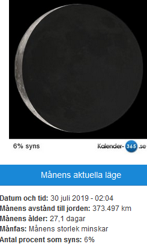
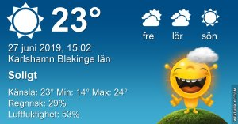

Idag går solen upp 04:15 och ned 21:52 Dagens längd är 17 timmar och 37 minuter. Det är gryning 03:11 och skymning 22:55 Det är dagsljus 19 timmar och 44 minuter. Månen går upp 01:57 och ned 15:12 Månen är belyst 35 %

 Mest klart 15 C  Vindby 1,8 m/s N  Luftfuktighet 83 %  hPa 1012 Kl.01:40

 Mest molnigt 18,2 C  Vindby 2 m/s E  Luftfuktighet 77 %  hPa 1013 Kl.07:15

 Växlande molnighet 28,4 C  Vindby 2,7 m/s E  Luftfuktighet 56 %  hPa 1015 Kl.13:30

 Halvklart 17,7 C  Vindby 1 m/s E  Luftfuktighet 89 %  hPa 1015  Regn 3,2 mm Kl.20:10

 Idag kom det en ordentlig skur, men ändå blev det bara 3,2 mm av det! Men bättre det än inget!

Högst och lägst uppmätta temperatur igår (inofficiellt privat mätare) Max 37,4 ( i solen )  , Min 11,9 C Högst uppmätta vind 4,1 m/s, Högst uppmätta vindby 6,8 m/s

Högst och lägst uppmätta temperatur igår (officiellt enligt [YR.NO](http://www.vackertvader.se/v%C3%A4derstation/karlshamn?utm_source=email&utm_medium=email&utm_campaign=asarum)) Max 30,2 C, Min 11,1 C Högst uppmätta vind 4,5 m/s. Högst uppmätta vindby 11,7 m/s

 

## _**Dags för mina gula vänner att komma till tals igen!**_

 

\[gallery type="rectangular" link="file" size="large" ids="30207,30208,30209,30210,30211,30212"\]
