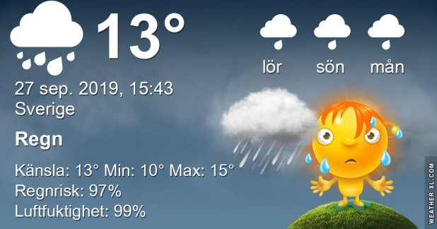

## Fredag 27 September

I dag gryr dagen i Asarum 06:18. Solen går upp klockan 06:55 och ner klockan 18:47 . Det mörknar vid 19:24. Dagens längd är 11 timmar och 52 minuter. Det är dagsljus 13 timmar och 06 minuter. Månen går upp 04:27 och ned 18:48 Månen är belyst 5 %

I Asarum blir dagen 4 minuter och 39 sekunder kortare. Dagen har blivit 5 timmar och 47 minuter kortare sedan sommarsolståndet. Vintersolstånd om 86 dagar.

Missa inte gyllene timmen som börjar klockan 18:00 i Asarum. Då står solen lågt och kastar ett fint gyllene ljus

 

 Molnigt 12,1 C  Vindby 2,2 m/s E  Luftfuktighet 95 %  hPa 1008 Kl.01:45

 Molnigt och disigt 12,9 C  Vindby 2 m/s E  Luftfuktighet 97 %  hPa 1006 Kl.06:55

 Regn 14,3 C  Vindby 2,4 m/s ENE  Luftfuktighet 99 %  hPa 1002   Regn 9,5 mm Kl.14:25

 Molnigt 11,2 C  Vindstilla  Luftfuktighet 97 %  hPa 1002  Regn 12,2 mm Kl.20:20

 Idag har det varit grått och regn nästan hela dagen! Verkligen höstrusk men ganska mysigt ändå!

Högst och lägst uppmätta temperatur igår (inofficiellt privat mätare) Max 22,3, Min 8,4 C Högst uppmätta vind 2 m/s, Högst uppmätta vindby 3,1 m/s

Högst och lägst uppmätta temperatur igår (officiellt enligt [YR.NO](http://www.vackertvader.se/v%C3%A4derstation/karlshamn?utm_source=email&utm_medium=email&utm_campaign=asarum)) Max 16,5 C, Min 9,8 C Högst uppmätta vind 4,2 m/s. Högst uppmätta vindby 7,5 m/s

 

## _**Repris från USA**_

 Jag har drömt mig tillbaka till Sedona i USA. Så här kommer en liten repris på några bilder därifrån.

\[gallery type="rectangular" link="file" size="large" ids="32050,32051,32052,32053,32054,32055,32056,32057,32058,32059,32060,32061,32062,32063,32064,32065,32066,32067,32068,32069,32070,32071,32072,32073,32074,32075,32076,32077,32078,32079,32080,32081,32082,32083,32084,32085,32086,32087,32088,32089,32090,32091,32092,32093,32094,32095,32096,32097,32098,32099,32100,32101,32102,32103,32104,32105,32106,32107,32108,32109,32110,32111,32112,32113,32114,32115,32116,32117"\]
