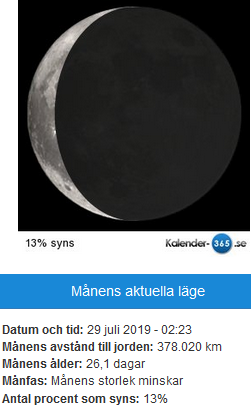
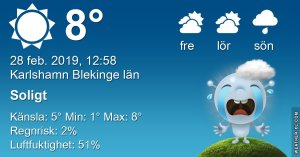

Idag går solen upp 06:56 och ned 17:31 Dagens längd är 10 timmar och 35 minuter. Det är gryning 06:18 och skymning 18:09 Det är dagsljus 11 timmar och 51 minuter. Månen går upp 03:50 och ned 11:09 Månen är belyst 35 %

 Mest klart 2,8 C  Vindby 1,4 m/s W  Luftfuktighet 79 %  hPa 1001 Kl.02:20

 Tunna moln och soldis - 0,3 C  Vindby 0,8 m/s ESE  Luftfuktighet 91 %  hPa 1000 Kl.07:30

 Klart 14,3 C  Vindby 3,4 m/s ESE  Luftfuktighet 32 %  hPa 1002 Kl.13:25

 Klart - 0,8 C  Vindby 0,3 m/s W  Luftfuktighet 57 %  hPa 1005 Kl.19:55

 

 Usch! Nu ska det bli kallt och snöblask igen!

Högst och lägst uppmätta temperatur igår (inofficiellt privat mätare) Max 18,7 ( i solen ) , Min – 3,3 C Högst uppmätta vind 4,4 m/s, Högst uppmätta vindby 9,9 m/s

Högst och lägst uppmätta temperatur igår (officiellt enligt [YR.NO](http://www.vackertvader.se/v%C3%A4derstation/karlshamn?utm_source=email&utm_medium=email&utm_campaign=asarum)) Max 14,3 C, Min – 2,8 C Högst uppmätta vind 2,2 m/s. Högst uppmätta vindby 8,6 m/s

\[gallery type="rectangular" link="file" size="large" ids="27502,27503,27504,27505,27506,27507,27508,27509,27510,27511,27512,27513" orderby="rand"\]

Lite lek med bilder där jag lagt på ett cartoonfilter och sedan ramat in bilderna. Resultatet blev varierande, men kul att göra  dem.
