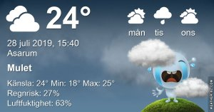

Idag går solen upp 04:55 och ned 21:17 Dagens längd är 16 timmar och 22 minuter. Det är gryning 04:05 och skymning 22:08 Det är dagsljus 18 timmar och 3 minuter. Månen går upp 01:21 och ned 17:53 Månen är belyst 22 %

 Molnigt och lite regn 18,4 C  Vindby 1,4 m/s NW  Luftfuktighet 85 %  hPa 1007 Kl.01:30

 Växlande molnighet 17,8 C  Vindby 2,2 m/s W  Luftfuktighet 92 %  hPa 1005 Kl.06:15

 Mest molnigt och blåsigt 30,2 C  Vindby 6,6 m/s NE  Luftfuktighet 53 %  hPa 1004 Kl.13:35

 Molnigt 23,6 C  Vindby 4 m/s N  Luftfuktighet 56 %  hPa 1004 Kl.20:35

 

 Varför kommer det aldrig regn hit!

Högst och lägst uppmätta temperatur igår (inofficiellt privat mätare) Max 30,4 ( i solen )  , Min 15,7 C Högst uppmätta vind 3,7 m/s, Högst uppmätta vindby 6,5 m/s

Högst och lägst uppmätta temperatur igår (officiellt enligt [YR.NO](http://www.vackertvader.se/v%C3%A4derstation/karlshamn?utm_source=email&utm_medium=email&utm_campaign=asarum)) Max 26,4 C, Min 17 C Högst uppmätta vind 4,6 m/s. Högst uppmätta vindby 10,6 m/s

 

## _**Fortsättning på gårdagens morgonrunda**_

 

\[gallery type="rectangular" link="file" size="large" ids="30754,30755,30756,30757,30758,30759,30760,30761,30762,30763,30764,30765,30766,30767,30770,30771"\]
