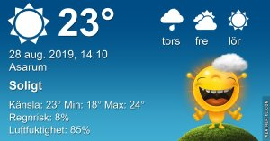

## Onsdag 28 augusti

I dag gryr dagen i Asarum 05:15. Solen går upp klockan 05:56 och ner klockan 20:07 . Det mörknar vid 20:47. Dagens längd är 14 timmar och 11 minuter. Det är dagsljus 15 timmar och 32 minuter. Månen går upp 02:44 och ned 19:29 Månen är belyst 9 %

I Asarum blir dagen 4 minuter och 29 sekunder kortare. Dagen har blivit 3 timmar och 29 minuter kortare sedan sommarsolståndet. Vintersolstånd om 116 dagar.

Missa inte gyllene timmen som börjar klockan 19:19 i Asarum. Då står solen lågt och kastar ett fint gyllene ljus.

 

 Växlande molnighet 18,9 C  Vindby 2,2 m/s NNW  Luftfuktighet 74 %  hPa 1014 Kl.01:50

 Regn och åskskurar 19,8 C  Vindby 1,6 m/s SSE  Luftfuktighet 80 %  hPa 1013 Kl.07:30

 Soldis och åska 30,5 C  Vindby 2,2 m/s NNE  Luftfuktighet 63 %  hPa 1011  Regn 5 mm Kl.13:40

 Molnigt 20,1 C  Vindby 0,3 m/s NW  Luftfuktighet 85 %  hPa 1010  Regn 7,7 mm Kl.20:00

 Idag har det varit rejält oväder med åska från tidig natt till långt in på eftermiddagen. Tyvärr blev det inte så mycket regn av det.

Högst och lägst uppmätta temperatur igår (inofficiellt privat mätare) Max 37,2 ( i solen ) , Min 13,9 C Högst uppmätta vind 2 m/s, Högst uppmätta vindby 3,7 m/s

Högst och lägst uppmätta temperatur igår (officiellt enligt [YR.NO](http://www.vackertvader.se/v%C3%A4derstation/karlshamn?utm_source=email&utm_medium=email&utm_campaign=asarum)) Max 26,8 C, Min 13,1 C Högst uppmätta vind 4,6 m/s. Högst uppmätta vindby 8 m/s

## _**Mörka moln och massor av blixt och dunder idag!**_

\[gallery type="rectangular" link="file" size="large" ids="31465,31466,31467,31468,31469,31470"\]

## _**Och lite reklam igen**_

\[gallery type="circle" link="file" size="large" ids="31471,31472,31473"\]
