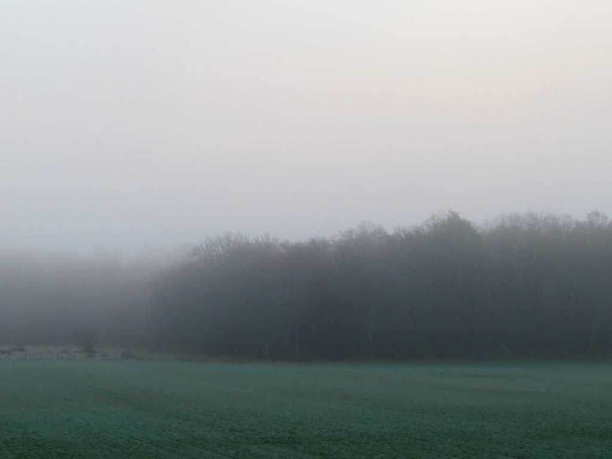
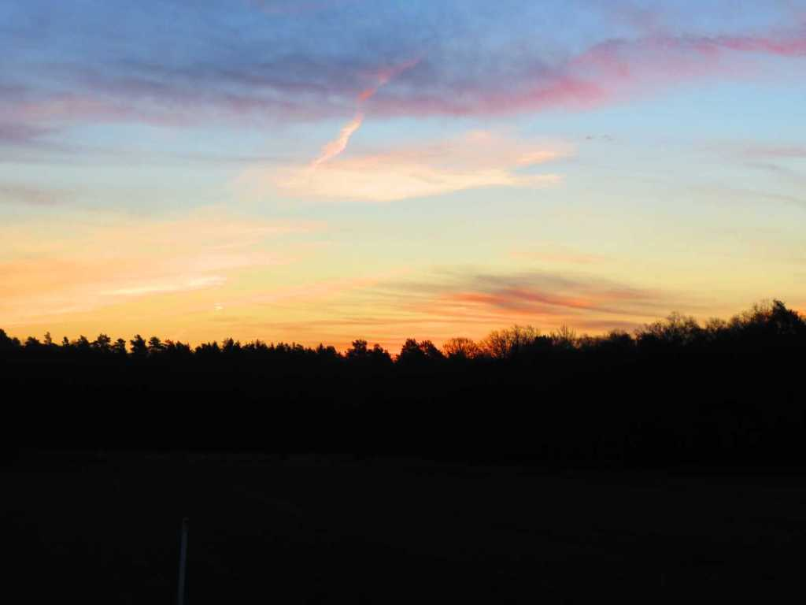

Idag går solen upp 05:40 och ned 18:32 Dagens längd är 12 timmar och 52 minuter. Det är gryning 05:02 och skymning 19:10 Det är dagsljus 14 timmar och 08 minuter. Månen går upp 03:30 och ned 10:41 Månen är belyst 42 %

 Tunna moln 4,7 C  Vindby 2 m/s SE  Luftfuktighet 83 %  hPa 1023 Kl.02:15

 Växlande molnighet 5,6 C  Vindby 3,4 m/s ESE  Luftfuktighet 73 %  hPa 1023 Kl.06:40

 Tunna slöjmoln 0ch blåsigt 18,8 C  Vindby 8,5 m/s SE  Luftfuktighet 40 %  hPa 1020 Kl.13:30

 Halvklart 7,7 C   Vindby 1,7 m/s SE  Luftfuktighet 63 %  hPa 1018 Kl.20:00

 Idag har det varit blåsigt och sommarvärme!

Högst och lägst uppmätta temperatur igår (inofficiellt privat mätare) Max 18,7 (i solen) , Min – 3,2 C Högst uppmätta vind 3,1 m/s, Högst uppmätta vindby 5,1 m/s

Högst och lägst uppmätta temperatur igår (officiellt enligt [YR.NO](http://www.vackertvader.se/v%C3%A4derstation/karlshamn?utm_source=email&utm_medium=email&utm_campaign=asarum)) Max 12,3 C, Min - 3,2 C Högst uppmätta vind 3,1 m/s. Högst uppmätta vindby 7 m/s

 Igår den 28/3

 Samma åker idag den 29/3

\[gallery type="rectangular" link="file" size="large" ids="28038,28039,28040,28041,28042,28043,28044" orderby="rand"\]

Några fler bilder från dagens soluppgång!
