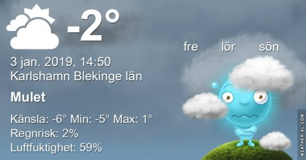
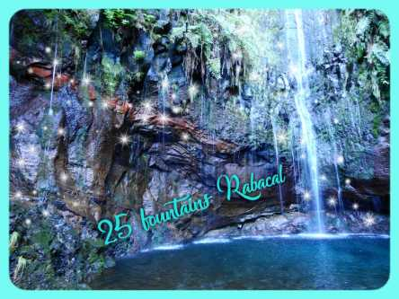

Idag går solen upp 08:33 och ned 15:38 Dagens längd är 7 timmar och 5 minuter. Det är gryning 07:46 och skymning 16:25 Det är dagsljus 8 timmar och 39 minuter. Månen går upp 05:52 och ned 13:36 Månen är belyst 9 %.

 Växlande molnighet - 1,5 C  Vindby 3,1 m/s SE  Luftfuktighet 50 %  hPa 1023 Kl.02:25

Mest klart - 4,7 C  Vindby 0,3 m/s SW  Luftfuktighet 58 %  hPa 1025 Kl.06:20

Mest klart 0,9 C  Vindby 2 m/s S  Luftfuktighet 48 %  hPa 1028 Kl.13:20

Ökande molnighet - 4 C  Vindstilla  Luftfuktighet 66 %  hPa 1028 Kl.19:50

 Efter en vecka med sol och skön värme är minusgrader inte så roliga.

Högst och lägst uppmätta temperatur igår (inofficiellt privat mätare) Max 5,2 C , Min - 3,1 C Högst uppmätta vind 6,5 m/s, Högst uppmätta vindby 9,2 m/s

Högst och lägst uppmätta temperatur igår (officiellt enligt [YR.NO](http://www.vackertvader.se/v%C3%A4derstation/karlshamn?utm_source=email&utm_medium=email&utm_campaign=asarum)) Max 3,4 C, Min - 1,5 C Högst uppmätta vind 7,1 m/s. Högst uppmätta vindby 18,9 m/s

 Några stylade bilder från vår ena levadapromenad på Madeira. Det var en väldigt jobbig väg på 1,2 mil fram och tillbaka med en 7 kilometer lång svart tunnel och långa sträckor med inte bredare än 50 cm att gå på med stup på några hundra meter rakt ner på ena sidan och bara en vajer att hålla sig i. Det var en vacker väg med underbar natur men som sagt väldigt svår och jobbig att gå. Jag är glad att vi gick den men skulle inte vilja göra det igen. Fler bilder utan styling kommer i andra inlägg framöver.
