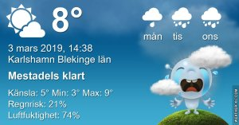

Idag går solen upp 06:48 och ned 17:38 Dagens längd är 10 timmar och 50 minuter. Det är gryning 06:11 och skymning 18:15 Det är dagsljus 12 timmar och 4 minuter. Månen går upp 06:05 och ned 13:54 Månen är belyst 11 %

 Molnigt 2 C  Vindby 2 m/s ENE  Luftfuktighet 85 %  hPa 1000 Kl.01:35

 Regn 3,9 C  Vindby 1,7 m/s E  Luftfuktighet 97 %  hPa 995  Regn 2,2 mm Kl.07:00

 Växlande molnighet 12 C  Vindby 6,5 m/s S  Luftfuktighet 61 %  hPa 991 Kl.13:05

 Molnigt 3,1 C  Vindby 0,3 m/s SE  Luftfuktighet 72 %  hPa 991 Kl.19:40

 Fint väder och man ligger sjuk med rinnande ögon och näsa!

Högst och lägst uppmätta temperatur igår (inofficiellt privat mätare) Max 9,3 ( i solen ) , Min – 5,6 C Högst uppmätta vind 3,1 m/s, Högst uppmätta vindby 4,4 m/s

Högst och lägst uppmätta temperatur igår (officiellt enligt [YR.NO](http://www.vackertvader.se/v%C3%A4derstation/karlshamn?utm_source=email&utm_medium=email&utm_campaign=asarum)) Max 3,4 C, Min – 5,3 C Högst uppmätta vind 0,5 m/s. Högst uppmätta vindby 5,8 m/s

 Minnen från Niagara fallen
