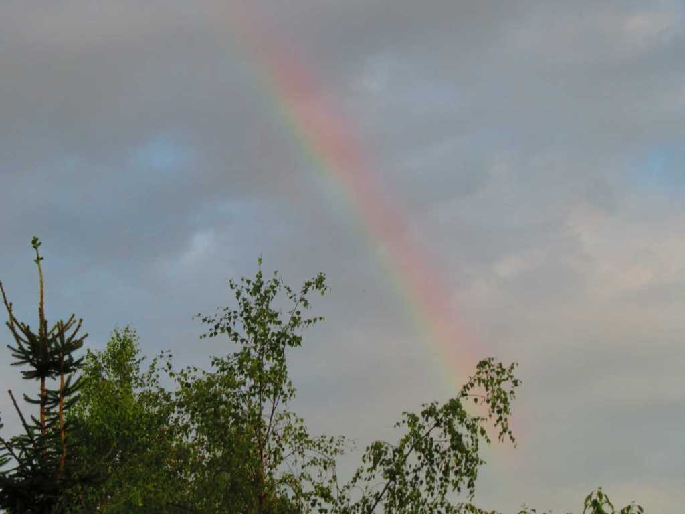

Idag går solen upp 05:07 och ned 21:06 Dagens längd är 15 timmar och 59 minuter. Det är gryning 04:18 och skymning 21:53 Det är dagsljus 17 timmar och 35 minuter. Månen går upp 08:02 och ned 22:24 Månen är belyst 5 %

 Molnigt 13,5 C  Vindby 0,7 m/s SW  Luftfuktighet 96 %  hPa 1009 Kl.02:10

 Växlande molnighet 15,9 C  Vindby 0,3 m/s NW  Luftfuktighet 89 %  hPa 1009 Kl.06:45

 Växlande molnighet och en del åskmuller 27,4 C  Vindby 2,4 m/s W  Luftfuktighet 51 %  hPa 1009 Kl.13:30

 Växlande molnighet 16,7 C  Vindby 0,8 m/s N  Luftfuktighet 89 %  hPa 1009  Regn 1,7 mm Kl.20:10

 Det kom ett par åskknallar och några ynka regndroppar och sen var solen framme igen! Blir så ledsen!

 

Högst och lägst uppmätta temperatur igår (inofficiellt privat mätare) Max 34,3 ( i solen )  , Min 9 C Högst uppmätta vind 1,7 m/s, Högst uppmätta vindby 2,7 m/s

Högst och lägst uppmätta temperatur igår (officiellt enligt [YR.NO](http://www.vackertvader.se/v%C3%A4derstation/karlshamn?utm_source=email&utm_medium=email&utm_campaign=asarum)) Max 25,1 C, Min 9 C Högst uppmätta vind 3 m/s. Högst uppmätta vindby 7,7 m/s

 

## _**Regnbåge utan regn**_

Igår dök det helt plötsligt upp en regnbåge ur tomma intet. Inte en regndroppe syntes någonstans och ändå blev det en båge!

 

## _**Möte på morgonen med de djur som vill visa sig**_

De är tyvärr inte så många men de som är ute är alltid lika roliga att se

\[gallery type="rectangular" link="file" size="large" ids="30926,30927,30928,30929,30930,30931,30932,30933,30934,30935,30936,30937,30938"\]
