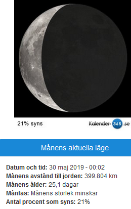
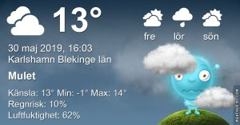

Idag går solen upp 04:24 och ned 21:33 Dagens längd är 17 timmar och 09 minuter. Det är gryning 03:27 och skymning 22:30 Det är dagsljus 19 timmar och 03 minuter. Månen går upp 03:36 och ned 16:18 Månen är belyst 21 %

 Klart 0,9 C  Vindstilla  Luftfuktighet 86 %  hPa 1019 Kl.01:30

 Halvklart 16,3 C  Vindby 2,6 m/s SW  Luftfuktighet 56 %  hPa 1018 Kl.07:45

 Molnigt 18,1 C  Vindby 3,8 m/s E  Luftfuktighet 67 %  hPa 1017 Kl.13:20

 Lätt regn 11,5 C  Vindby 4 m/s SW  Luftfuktighet 95 %  hPa 1012  Regn 1,8 mm Kl.19:40

 

 Idag har det varit kallt och ruggigt. Inte inbjudande alls till uteaktiviteter.

 

Högst och lägst uppmätta temperatur igår (inofficiellt privat mätare) Max 22,4 ( i solen ) , Min - 0,4 C Högst uppmätta vind 3,7 m/s, Högst uppmätta vindby 7,1 m/s

Högst och lägst uppmätta temperatur igår (officiellt enligt [YR.NO](http://www.vackertvader.se/v%C3%A4derstation/karlshamn?utm_source=email&utm_medium=email&utm_campaign=asarum)) Max 15,8 C, Min 0,8 C Högst uppmätta vind 4,2 m/s. Högst uppmätta vindby 10,2 m/s

 

## **_Las Vegas Nevada_**

 

 Tillbaks i Vegas!

\[gallery type="rectangular" link="file" size="large" ids="29499,29500,29501,29502,29503,29504,29505,29506,29507,29508,29509,29510,29511,29512,29513,29514,29515,29516,29517,29518,29519,29520,29521,29522,29523,29524,29525,29526,29527,29528,29529,29530,29531,29532,29533,29534,29535,29536,29537,29538,29540,29541,29542,29543,29544,29545,29546,29547,29548,29549,29550,29551,29552,29553,29554,29555,29556,29557,29558,29559,29560,29561,29562,29563,29564,29565,29566,29567,29568,29569,29570,29571,29572,29573,29574,29576,29578,29579,29580,29581,29582,29583,29584,29585,29586,29587"\]

 Då var vår resa över! Vi har haft en helt otrolig upplevelse och fått se mer än vi kunnat drömma om. Den här resan var en dröm som gick i uppfyllelse. Jag hoppas att vi någon gång får tillfälle att åka tillbaks och se mer av detta helt otroliga land som är USA!

Tack alla som velat följa mina inlägg från denna oförglömliga resa!
