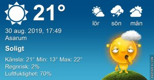

## Fredag 30 augusti

I dag gryr dagen i Asarum 05:20. Solen går upp klockan 06:00 och ner klockan 20:02 . Det mörknar vid 20:41. Dagens längd är 14 timmar och 02 minuter. Det är dagsljus 15 timmar och 21 minuter. Månen går upp 05:31 och ned 20:26 Månen är belyst 0 %

I Asarum blir dagen 4 minuter och 35 sekunder kortare. Dagen har blivit 3 timmar och 38 minuter kortare sedan sommarsolståndet. Vintersolstånd om 114 dagar.

Missa inte gyllene timmen som börjar klockan 19:14 i Asarum. Då står solen lågt och kastar ett fint gyllene ljus.

 

 Halvklart 13,5 C  Vindstilla  Luftfuktighet 97 %  hPa 1014 Kl.02:00

 Dimma 11,5 C  Vindby 0,3 m/s N  Luftfuktighet 99 %  hPa 1016 Kl.06:50

 Mest molnigt 27,5 C  Vindby 4,2 m/s W  Luftfuktighet 51 %  hPa 1017 Kl.14:35

 Mest molnigt 16,6 C  Vindstilla  Luftfuktighet 84 %  hPa 1017 Kl.20:05

Lite svalare men  fortfarande för varmt när solen ligger på!

Högst och lägst uppmätta temperatur igår (inofficiellt privat mätare) Max 31,5 ( i solen ) , Min 14,1 C Högst uppmätta vind 2 m/s, Högst uppmätta vindby 3,4 m/s

Högst och lägst uppmätta temperatur igår (officiellt enligt [YR.NO](http://www.vackertvader.se/v%C3%A4derstation/karlshamn?utm_source=email&utm_medium=email&utm_campaign=asarum)) Max ? C, Min ? C Högst uppmätta vind ? m/s. Högst uppmätta vindby ? m/s

 

## _**Reklampaus**_

för mina senaste urtavlor

 

\[gallery type="circle" link="file" size="large" ids="31516,31514,31513,31512,31511,31510,31509"\]
