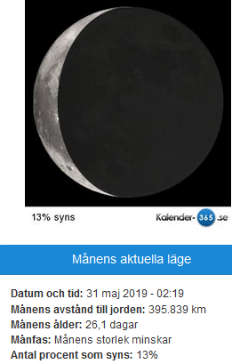
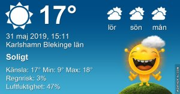

Idag går solen upp 04:23 och ned 21:34 Dagens längd är 17 timmar och 11 minuter. Det är gryning 03:25 och skymning 22:32 Det är dagsljus 19 timmar och 07 minuter. Månen går upp 03:58 och ned 17:32 Månen är belyst 13 %

  Molnigt 13,7 C  Vindby 1,8 m/s W  Luftfuktighet 95 %  hPa 1012 Kl.02:25

 Molnigt o9ch en del regnskurar 14,3 C  Vindby 0,7 m/s ENE  Luftfuktighet 92 %  hPa 1013 Kl.08:40

 Växlande molnighet 24,7 C  Vindby 4 m/s W  Luftfuktighet 38 %  hPa 1014 Kl.14:35

 Mest klart 15,9 C  Vindby 2,2 m/s NW  Luftfuktighet 18 %  hPa 1015 Kl.19:45

 

 Nu är värmen tillbaka, men regnet vägrar komma hit 😢

Högst och lägst uppmätta temperatur igår (inofficiellt privat mätare) Max 19,6 ( i solen ) , Min – 0,5 C Högst uppmätta vind 3,4 m/s, Högst uppmätta vindby 6,1 m/s

Högst och lägst uppmätta temperatur igår (officiellt enligt [YR.NO](http://www.vackertvader.se/v%C3%A4derstation/karlshamn?utm_source=email&utm_medium=email&utm_campaign=asarum)) Max 13,5 C, Min - 0,9 C Högst uppmätta vind 4 m/s. Högst uppmätta vindby 9,4 m/s

 

## **_Tillbaka till vardagen_**

 

\[gallery type="rectangular" link="file" size="large" ids="29603,29604,29605,29606,29607,29608,29609,29610,29611,29612,29613,29614"\]

Då var man tillbaka till verkligheten igen med allt vad det innebär. Nytt distrikt som jag jobbar på med mycket mer natur och djur. Här ett litet smakprov på allt jag sett de här första veckorna tidigt på morgonen när jag jobbar.
