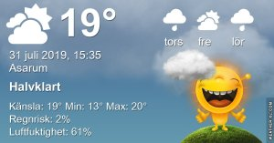

Idag går solen upp 05:01 och ned 21:12 Dagens längd är 16 timmar och 11 minuter. Det är gryning 04:11 och skymning 22:01 Det är dagsljus 17 timmar och 50 minuter. Månen går upp 03:49 och ned 20:56 Månen är belyst 2 %

 Mest molnigt 12,9 C  Vindby 1,4 m/s E  Luftfuktighet 77 %  hPa 1012 Kl.02:20

 Molnigt 14,4 C  Vindby 2,6 m/s E  Luftfuktighet 72 %  hPa 1013 Kl.07:15

 Växlande molnighet 28,3 C  Vindby 3,4 m/s E  Luftfuktighet 40 %   hPa 1013 Kl.14:05

 Mest molnigt 16,1 C Vindby 1 m/s N  Luftfuktighet 68 %  hPa 1013 Kl.20:10

 Äntligen lite mer normalt sommarväder med svalare nätter och lagom varmt på dagen

 

Högst och lägst uppmätta temperatur igår (inofficiellt privat mätare) Max 21,2  , Min 13,6 C Högst uppmätta vind 1,7 m/s, Högst uppmätta vindby 3,1 m/s

Högst och lägst uppmätta temperatur igår (officiellt enligt [YR.NO](http://www.vackertvader.se/v%C3%A4derstation/karlshamn?utm_source=email&utm_medium=email&utm_campaign=asarum)) Max ? C, Min ? C Högst uppmätta vind ? m/s. Högst uppmätta vindby ? m/s

 

## _**I brist på motivation...**_

och eftersom djuren håller sig undan på min runda och solen gömer sig bakom molnen så blir det bara urtavlor idag igen. Roligare bilder blir det när ork, lust och motivation infinner sig igen.

 

\[gallery type="circle" link="file" size="large" ids="30798,30799,30800,30801,30802,30803,30804,30805,30806,30807,30808,30810,30811,30812,30813,30814"\]
