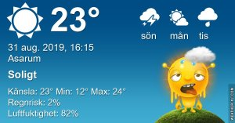

## Lördag 31 Augusti

I dag gryr dagen i Asarum 05:22. Solen går upp klockan 06:02 och ner klockan 19:59 . Det mörknar vid 20:39. Dagens längd är 13 timmar och 57 minuter. Det är dagsljus 15 timmar och 17 minuter. Månen går upp 07:02 och ned 20:46 Månen är belyst 0 %

I Asarum blir dagen 4 minuter och 33 sekunder kortare. Dagen har blivit 3 timmar och 42 minuter kortare sedan sommarsolståndet. Vintersolstånd om 113 dagar.

Missa inte gyllene timmen som börjar klockan 19:11 i Asarum. Då står solen lågt och kastar ett fint gyllene ljus.

 

 Mest klart 10,8 C  Vindstilla  Luftfuktighet 98 %  hPa 1017 Kl.01:50

 Dimma 11,6 C  Vindstilla  Luftfuktighet 99 %  hPa 1016 Kl.06:35

 Mest molnigt och soldis 28 C  Vindby 3,6 m/s SSW  Luftfuktighet 61 %  hPa 1013 Kl.15:00

 Molnigt 20,5 C  Vindby 0,7 m/s NW  Luftfuktighet 81 %  hPa 1010 Kl.20:05

Fortfarande varmt här!

Högst och lägst uppmätta temperatur igår (inofficiellt privat mätare) Max 33,3 ( i solen ) , Min 11,1 C Högst uppmätta vind 2,7 m/s, Högst uppmätta vindby 4,4 m/s

Högst och lägst uppmätta temperatur igår (officiellt enligt [YR.NO](http://www.vackertvader.se/v%C3%A4derstation/karlshamn?utm_source=email&utm_medium=email&utm_campaign=asarum)) Max ? C, Min ? C Högst uppmätta vind ? m/s. Högst uppmätta vindby ? m/s

## _**Tidig morgon med dimma**_

 

\[gallery type="rectangular" link="file" size="large" ids="31526,31527,31528,31529,31530,31531,31532,31533,31534,31535,31536,31537,31538,31539,31540,31541,31542,31543,31544,31545"\]
