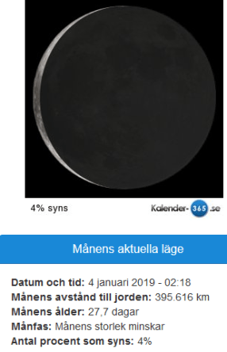
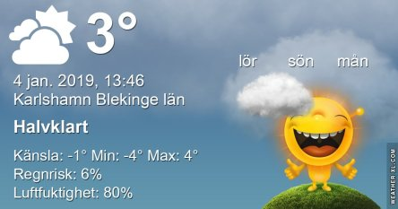
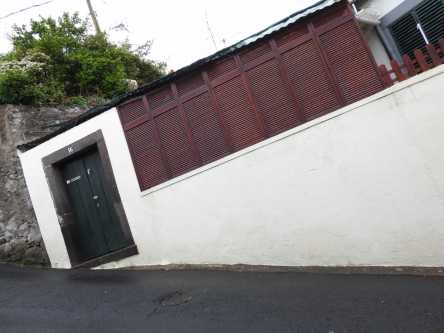
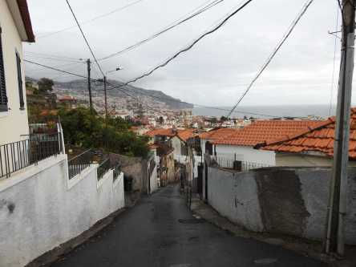

Idag går solen upp 08:32 och ned 15:39 Dagens längd är 7 timmar och 7 minuter. Det är gryning 07:45 och skymning 16:26 Det är dagsljus 8 timmar och 41 minuter. Månen går upp 06:59 och ned 14:31 Månen är belyst 4 %.

Mest klart - 4,5 C  Vindstilla  Luftfuktighet 70 %  hPa 1023 Kl.02:15

Mest molnigt - 2 C  Vindstilla  Luftfuktighet 79 %  hPa 1018 Kl.06:40

Växlande molnighet 6,5 C  Vindby 1,8 m/s ENE  Luftfuktighet 59 %  hPa 1014 Kl.13:25

 Molnigt 2,1 C  Vindby 0,7 m/s N Luftfuktighet 78 %  hPa 1012 Kl.19:50

 Äntligen lite varmare igen!

Högst och lägst uppmätta temperatur igår (inofficiellt privat mätare) Max 3,6 C , Min – 6,9 C Högst uppmätta vind 2,7 m/s, Högst uppmätta vindby 4,1 m/s

Högst och lägst uppmätta temperatur igår (officiellt enligt [YR.NO](http://www.vackertvader.se/v%C3%A4derstation/karlshamn?utm_source=email&utm_medium=email&utm_campaign=asarum)) Max 0,5 C, Min – 6,6 C Högst uppmätta vind 3,3 m/s. Högst uppmätta vindby 6,9 m/s

 Vårt hotell långt uppe på höjden. Den backen vi fick gå uppför varje kväll var som ett helt pass på gymmet!

Här får man en liten uppfattning om hur brant det är på Madeira. Kameran är i samma lutning som vägen så det ser ut som om huset lutar istället.

Här ser man backen vi går i för att komma vidare upp till slottet som vi ser från vårt hotell.
