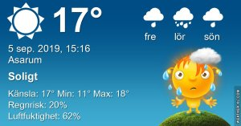

## Torsdag 5 September

I dag gryr dagen i Asarum 05:32. Solen går upp klockan 06:11 och ner klockan 19:46 . Det mörknar vid 20:25. Dagens längd är 13 timmar och 35 minuter. Det är dagsljus 14 timmar och 53 minuter. Månen går upp 14:14 och ned 22:24 Månen är belyst 38 %

I Asarum blir dagen 4 minuter och 36 sekunder kortare. Dagen har blivit 4 timmar och 5 minuter kortare sedan sommarsolståndet. Vintersolstånd om 108 dagar.

Missa inte gyllene timmen som börjar klockan 18:59 i Asarum. Då står solen lågt och kastar ett fint gyllene ljus

 Regn 14,3 C  Vindby 3 m/s E  Luftfuktighet 91 %  hPa 1003  Regn 0,5 mm Kl.01:15

 Växlande molnighet 13,7 C  Vindby 2,4 m/s S  Luftfuktighet 93 %   hPa 1002 Kl.06:50

 Växlande molnighet 22,2 C  Vindby 1,8 m/s S  Luftfuktighet 66 %  hPa 1003

 Molnigt 10,3 C  Vindstilla  Luftfuktighet 92 %  hPa 1006  Regn 4 mm Kl.20:20

 Idag kom det en kort åskskur med blixt och dunder, men den försvann lika fort som den kom

Högst och lägst uppmätta temperatur igår (inofficiellt privat mätare) Max 23,4 ( i solen ) , Min 6,2 C Högst uppmätta vind 3,1 m/s, Högst uppmätta vindby 5,4 m/s

Högst och lägst uppmätta temperatur igår (officiellt enligt [YR.NO](http://www.vackertvader.se/v%C3%A4derstation/karlshamn?utm_source=email&utm_medium=email&utm_campaign=asarum)) Max 19,8 C, Min 5,6 C Högst uppmätta vind 3,6 m/s. Högst uppmätta vindby 8,3 m/s

 

## _**Slöjor av vitt dansar över vattnet**_

 

\[gallery type="rectangular" link="file" size="large" ids="31656,31657,31658,31659,31660,31661,31662,31663,31664,31665,31666"\]
