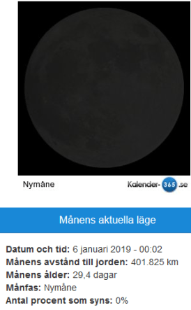
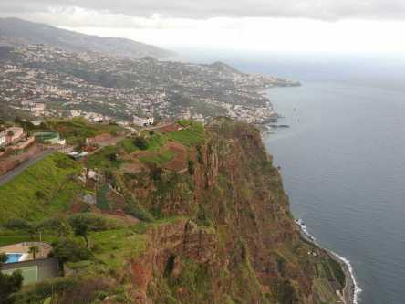
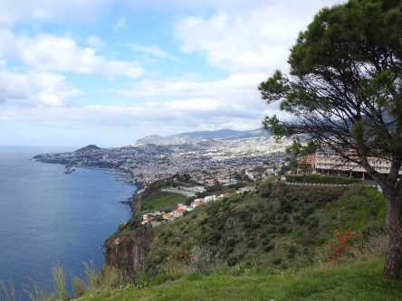

Idag går solen upp 08:31 och ned 15:42 Dagens längd är 7 timmar och 11 minuter. Det är gryning 07:45 och skymning 16:28 Det är dagsljus 8 timmar och 43 minuter. Månen går upp 08:47 och ned 16:07 Månen är belyst 0 %.

 Klart - 8 C  Vindby 0,3 m/s S  Luftfuktighet 79 %  hPa 1021 Kl.01:00

Mest molnigt - 3,7 C  Vindstilla  Luftfuktighet 80 %  hPa 1023 Kl.07:30

Lätt snö 1,9 C  Vindby 0,7 m/s NE  Luftfuktighet 71 %  hPa 1023 Kl.12:50

Växlande molnighet - 1,3 C  Vindby 0,7 m/s SE  Luftfuktighet 80 %  hPa 1022 Kl.20:10

 Kallt och ruggigt. Längtar till våren!

Högst och lägst uppmätta temperatur igår (inofficiellt privat mätare) Max 7,4 C , Min – 7,7 C Högst uppmätta vind 2,4 m/s, Högst uppmätta vindby 4,1 m/s

Högst och lägst uppmätta temperatur igår (officiellt enligt [YR.NO](http://www.vackertvader.se/v%C3%A4derstation/karlshamn?utm_source=email&utm_medium=email&utm_campaign=asarum)) Max 4,7 C, Min – 7,3 C Högst uppmätta vind 3,9 m/s. Högst uppmätta vindby 9,4 m/s

\[gallery type="rectangular" link="file" size="large" ids="26317,26318,26319,26320,26321"\]

Några roliga och några tänkvärda ord, att tas på allvar... eller inte. Välj själva.

Några utsiktsbilder från Madeira taget vid Cabo Girao glasveranda och på vägen upp till Botaniska trädgården.
