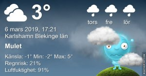
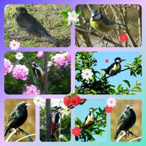

Idag går solen upp 06:41 och ned 17:44 Dagens längd är 11 timmar och 03 minuter. Det är gryning 06:03 och skymning 18:22 Det är dagsljus 12 timmar och 19 minuter. Månen går upp 07:13 och ned 17:18 Månen är belyst 0 %

 Molnigt - 1,7 C  Vindby 1 m/s NW  Luftfuktighet 91 %  hPa 1004 Kl.02:05

 Molnigt 0,7 C  Vindby 2,8 m/s N  Luftfuktighet 93 %  hPa 1005 Kl.07:10

 Molnigt 6,2 C  Vindby 2,2 m/s N  Luftfuktighet 91 %  hPa 1004  Regn 1,7 mm Kl.13:10

 Regn 3,2 C  Vindby 2,8 m/s NE  Luftfuktighet 95 %  hPa 999  Regn 3,5 mm Kl.20:00

 Kallt och blåsigt! Ingen vårkänsla överhuvudtaget längre!

Högst och lägst uppmätta temperatur igår (inofficiellt privat mätare) Max 5,2 , Min - 1,4 C Högst uppmätta vind 3,7 m/s, Högst uppmätta vindby 5,1 m/s

Högst och lägst uppmätta temperatur igår (officiellt enligt [YR.NO](http://www.vackertvader.se/v%C3%A4derstation/karlshamn?utm_source=email&utm_medium=email&utm_campaign=asarum)) Max 4,5 C, Min - 1,3 C Högst uppmätta vind 2,6 m/s. Högst uppmätta vindby 8,5 m/s

 Idag får det bli fågelcollage med bilder från arkivet.

\[gallery type="rectangular" link="file" size="large" ids="27663,27664,27662,27661,27660"\]

Och självklart några minioner som får komma till tals
