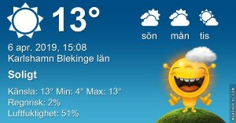

Idag går solen upp 06:19 och ned 19:48 Dagens längd är 13 timmar och 29 minuter. Det är gryning 05:40 och skymning 20:27 Det är dagsljus 14 timmar och 47 minuter. Månen går upp 07:13 och ned 20:58 Månen är belyst 0 %

 Halvklart 4,6 C  Vindby 2,4 m/s E  Luftfuktighet 66 %  hPa 1009 Kl.01:20

 Tunna slöjmoln 2,7 C  Vindby 1,8 m/s WNW  Luftfuktighet 76 %  hPa 1010 Kl.06:30

 Tunna slöjmoln 19,8 C  Vindby 4 m/s E  Luftfuktighet 29 %  hPa 1010 Kl.13:40

 Tunna slöjmoln 8,8 C  Vindby 1,8 m/s E  Luftfuktighet 50 %  hPa 1009 Kl.19:55

 Ännu en förhandsglimt av sommaren. Så härligt! Men det behövs regn nu, det är kruttorrt i jorden!

Högst och lägst uppmätta temperatur igår (inofficiellt privat mätare) Max 20,8 ( i solen ) , Min 2,5 C Högst uppmätta vind 4,1 m/s, Högst uppmätta vindby 5,4 m/s

Högst och lägst uppmätta temperatur igår (officiellt enligt [YR.NO](http://www.vackertvader.se/v%C3%A4derstation/karlshamn?utm_source=email&utm_medium=email&utm_campaign=asarum)) Max 16,5 C, Min 3,2 C Högst uppmätta vind 5,1 m/s. Högst uppmätta vindby 10,5 m/s

 

\[gallery type="rectangular" link="file" size="large" ids="28160,28161,28162" orderby="rand"\]

En underbar sommarvarm och solig dag. Här är några av de blommor som lyser upp tillvaron i den annars hårt prövade trädgården efter förra sommarens torka. Bilderna är tagna med mobilen så de är lite gryniga, men jag är nöjd med dem ändå.

 Dagens citat!
