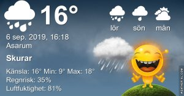

## Fredag 6 September

I dag gryr dagen i Asarum 05:34. Solen går upp klockan 06:13 och ner klockan 19:43 . Det mörknar vid 20:22. Dagens längd är 13 timmar och 30 minuter. Det är dagsljus 14 timmar och 48 minuter. Månen går upp 15:29 och ned 22:57 Månen är belyst 49 %

I Asarum blir dagen 4 minuter och 36 sekunder kortare. Dagen har blivit 4 timmar och 10 minuter kortare sedan sommarsolståndet. Vintersolstånd om 107 dagar.

Missa inte gyllene timmen som börjar klockan 18:56 i Asarum. Då står solen lågt och kastar ett fint gyllene ljus

 

 Regn 10,8 C  Vindby 1,7 m/s SE  Luftfuktighet 96 %  hPa 1009  Regn 2,2 mm Kl.02:15

 Höga tunna moln 8,4 C  Vindby 2,2 m/s ESE  Luftfuktighet 95 %  hPa 1012  Regn 2,7 mm Kl.07:05

 Molnigt 18,8 C  Vindby 2,6 m/s SE  Luftfuktighet 66 %  hPa 1014 Kl.14:55

 Mest molnigt 12,6 C  Vindby 1 m/s E  Luftfuktighet 81 %  hPa 1013 Kl.20:14

 

Det blev inte så mycket av regnet den här gången heller

Högst och lägst uppmätta temperatur igår (inofficiellt privat mätare) Max 22,2 ( i solen ) , Min 9,1 C Högst uppmätta vind 3,1 m/s, Högst uppmätta vindby 5,1 m/s

Högst och lägst uppmätta temperatur igår (officiellt enligt [YR.NO](http://www.vackertvader.se/v%C3%A4derstation/karlshamn?utm_source=email&utm_medium=email&utm_campaign=asarum)) Max 19,7 C, Min 10,6 C Högst uppmätta vind 2,5 m/s. Högst uppmätta vindby 7,3 m/s

 

## _**Plötsligt stod den där mitt på vägen i mörkret...**_

gråhägern som jag såg i somras flera gånger men som alltid flög iväg när jag kom. Men nu när det var mörkt och inte särskilt bra läge att ta bilder så passade det att stå stilla hur länge som helst. Tur att jag har bra lyse på bilen så det blev några halvbra bilder åtminstone.

\[gallery type="rectangular" link="file" size="large" ids="31677,31678,31679,31680,31681,31682"\]
