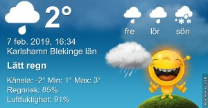

Idag går solen upp 07:45 och ned 16:45 Dagens längd är 9 timmar och 0 minuter. Det är gryning 07:05 och skymning 17:26 Det är dagsljus 10 timmar och 21 minuter. Månen går upp 09:05 och ned 19:27 Månen är belyst 4 %.

 Dis och dimma 2,4 C  Vindby 0,3 m/s S  Luftfuktighet 88 %  hPa 1010 Kl.01:45

 Dis och dimma 2,5 C  Vindby 0,3 m/s N  Luftfuktighet 88 %  hPa 1008 Kl.06:15

 Regn 3,7 C  Vindby 2,7 m/s N  Luftfuktighet 89 %  hPa 1002  Regn 2,7 mm Kl.14:35

 Molnigt 2,4 C  Vindby 1,4 m/s E  Luftfuktighet 88 %  hPa 1000  Regn 6,2 mm Kl.19:55

Plusgrader och regn = snösmältning! Jippi!

Högst och lägst uppmätta temperatur igår (inofficiellt privat mätare) Max 3,1 C , Min – 1,1 C Högst uppmätta vind 2,7 m/s, Högst uppmätta vindby 5.1 m/s

Högst och lägst uppmätta temperatur igår (officiellt enligt [YR.NO](http://www.vackertvader.se/v%C3%A4derstation/karlshamn?utm_source=email&utm_medium=email&utm_campaign=asarum)) Max 2,3 C, Min – 0,9 C Högst uppmätta vind 2,9 m/s. Högst uppmätta vindby 9 m/s

\[gallery type="rectangular" link="file" size="large" ids="27135,27134,27133,27132,27131,27130,27129,27128,27127,27126,27125,27124,27123,27122,27121,27120"\]

Minionerna, som vanligt några tänkvärda, några roliga och några småelaka.
