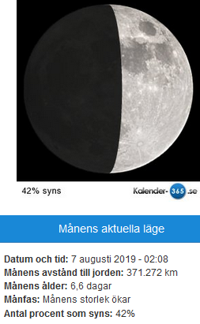

Idag går solen upp 06:14 och ned 19:53 Dagens längd är 13 timmar och 39 minuter. Det är gryning 05:35 och skymning 20:32 Det är dagsljus 14 timmar och 57 minuter. Månen går upp 07:56 och ned 23:18 Månen är belyst 7 %

 Mest molnigt 4,2 C  Vindby 1,4 m/s W  Luftfuktighet 70 %  hPa 1007 Kl.01:30

 Molnigt 3 C  Vindby 1,7 m/s N  Luftfuktighet 71 %  hPa 1009 Kl.06:30

 Växlande molnighet 12,5 C  Vindby 3,6 m/s NE  Luftfuktighet 44 %   hPa 1011 Kl.13:35

 Mest molnigt 3,9 C  Vindby 1,6 m/s S  Luftfuktighet 77 %  hPa 1012 Kl.19:45

 Nu blir det kallare och gråare igen! Suck!

Högst och lägst uppmätta temperatur igår (inofficiellt privat mätare) Max 22,9 ( i solen ) , Min - 0,6 C Högst uppmätta vind 2 m/s, Högst uppmätta vindby 3,7 m/s

Högst och lägst uppmätta temperatur igår (officiellt enligt [YR.NO](http://www.vackertvader.se/v%C3%A4derstation/karlshamn?utm_source=email&utm_medium=email&utm_campaign=asarum)) Max 15,6 C, Min - 1,3 C Högst uppmätta vind 2,9 m/s. Högst uppmätta vindby 6 m/s

\[gallery type="rectangular" link="file" size="large" ids="28191,28192,28194,28195,28196,28197" orderby="rand"\]

Här är några roliga skyltar som jag hittat på nätet.
