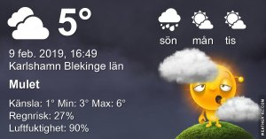
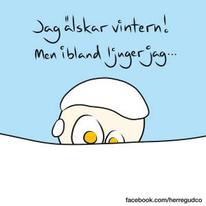

Idag går solen upp 07:41 och ned 16:50 Dagens längd är 9 timmar och 9 minuter. Det är gryning 07:01 och skymning 17:30 Det är dagsljus 10 timmar och 29 minuter. Månen går upp 09:35 och ned 20:45 Månen är belyst 15 %.

 Molnigt 3,8 C  Vindby 2,4 m/s SSW  Luftfuktighet 86 %   hPa 997 Kl.02:05

 Regn 3,6 C  Vindby 5,4 m/s NNE  Luftfuktighet 83 %  hPa 993  Regn 0,5 mm Kl.06:50

 Växlande molnighet 6,6 C  Vindby 3,6 m/s NE  Luftfuktighet 82 %  hPa 991  Regn 3,7 mm Kl.14:50

 Lätt regn 4,9 C  Vindby 4 m/s ENE  Luftfuktighet 85 %  hPa 990  Regn 5 mm Kl.20:55

 Även om det är grått och trist tröttväder igen så är det bättre än snöväder

Högst och lägst uppmätta temperatur igår (inofficiellt privat mätare) Max 7,6 C , Min 3,1 C Högst uppmätta vind 4,1 m/s, Högst uppmätta vindby 6,4 m/s

Högst och lägst uppmätta temperatur igår (officiellt enligt [YR.NO](http://www.vackertvader.se/v%C3%A4derstation/karlshamn?utm_source=email&utm_medium=email&utm_campaign=asarum)) Max 6,3 C, Min 3,1 C Högst uppmätta vind 2,9 m/s. Högst uppmätta vindby 8,8 m/s

 Så sant som det är sagt!
