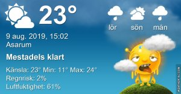

Idag går solen upp 05:18 och ned 20:53 Dagens längd är 15 timmar och 35 minuter. Det är gryning 04:32 och skymning 21:38 Det är dagsljus 17 timmar och 06 minuter. Månen går upp 16:26 och ned 00:07 Månen är belyst 64 %

 Molnigt 11,9 C  Vindstilla  Luftfuktighet 98 %  hPa 1002 Kl.02:15

 Växlande molnighet 13,4 C  Vindby 1,2 m/s W  Luftfuktighet 95 %  hPa 1004 Kl.07:15

 Växlande molnighet 28,6 C  Vindby 2,4 m/s S  Luftfuktighet 40 %  hPa 1006 Kl.13:15

 Molnigt 19,5 C  Vindby 0,7 m/s E  Luftfuktighet 72 %  hPa 1007 Kl.20:00

 Varmt och eländigt och noll mm regn!

 

Högst och lägst uppmätta temperatur igår (inofficiellt privat mätare) Max 28,1 ( i solen )  , Min 9,4 C Högst uppmätta vind 3,1 m/s, Högst uppmätta vindby 5,4 m/s

Högst och lägst uppmätta temperatur igår (officiellt enligt [YR.NO](http://www.vackertvader.se/v%C3%A4derstation/karlshamn?utm_source=email&utm_medium=email&utm_campaign=asarum)) Max 23,6 C, Min 8,7 C Högst uppmätta vind 3,7 m/s. Högst uppmätta vindby 8,4 m/s

 

## _**Rådjur i dimman**_

 

\[gallery type="rectangular" link="file" size="large" ids="31045,31046,31047,31048,31049,31050,31051,31052,31053,31054,31055,31056"\]
