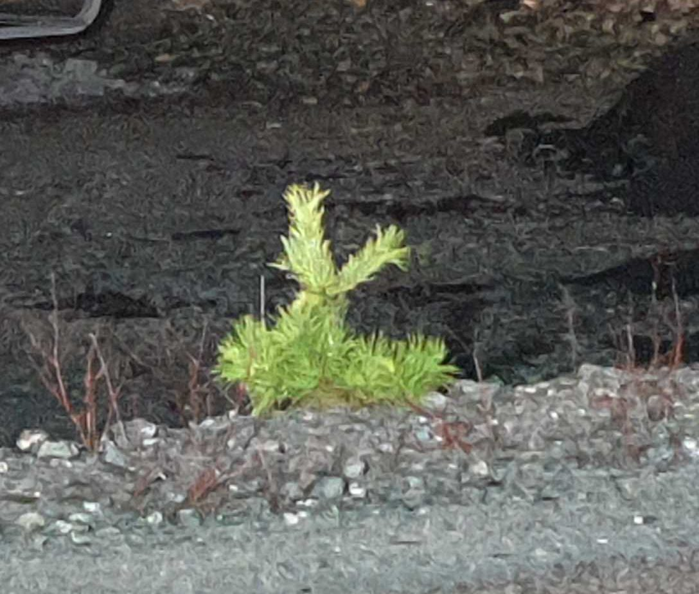

## _**Månen "vandrar" mellan molnen**_

\[gallery type="rectangular" link="file" size="large" ids="34891,34892,34893,34894,34895"\]

\[gallery type="rectangular" link="file" size="large" ids="34896,34897,34898,34899"\]

 Är det någon som ser den lilla "kaninen" vid vägrenen?
