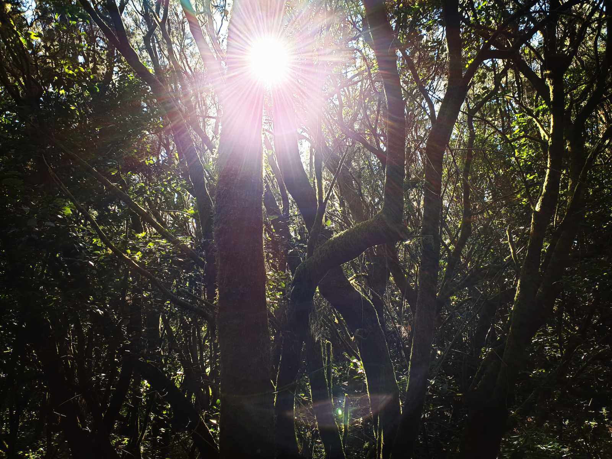

## _**Ett besök i en otroligt vacker skog**_

La Gomeras största naturskatt är öns skogar med frodiga, gröna lagerliknande träd som präglar öns bergiga centrala delar. Laurisilva, som det fanns gott om för flera miljoner år sedan, finns idag endast på ett fåtal platser i världen. En av dem är Kanarieöarna. Och de bästa kvarlevande exemplaren skyddas i de nästan 4 000 hektar stora ravinerna med bäckar och branta krön i Garajonay nationalpark, en plats där naturen fortfarande härskar.

\[gallery type="rectangular" link="file" size="large" ids="33927,33928,33929,33930,33931,33932,33933,33934,33935,33936,33937,33938,33939,33940,33941,33942,33943,33944,33945"\]

Det blev många bilder från skogen men den är så vacker så jag tycker den förtjänar att ta lite plats. Jag skulle kunnat gå här mycket längre än vi gjorde och sluppit vår guides eviga malande och istället fått njuta av tystnaden och skogens ljud. Jag gick en bit i förväg för att slippa höra honom för någon minut och ta lite bilder i lugn och ro, men då ropade han och sa att vi inte skulle gå i förväg!!! Jag kunde inte bry mig mindre hahaha!

 Den här bilden är jag extra stolt över! Den är inte redigerad! Stjärnan som solen bildade mellan trädkronorna är precis som den blev när jag tog bilden. Tycker det blev så vackert!
