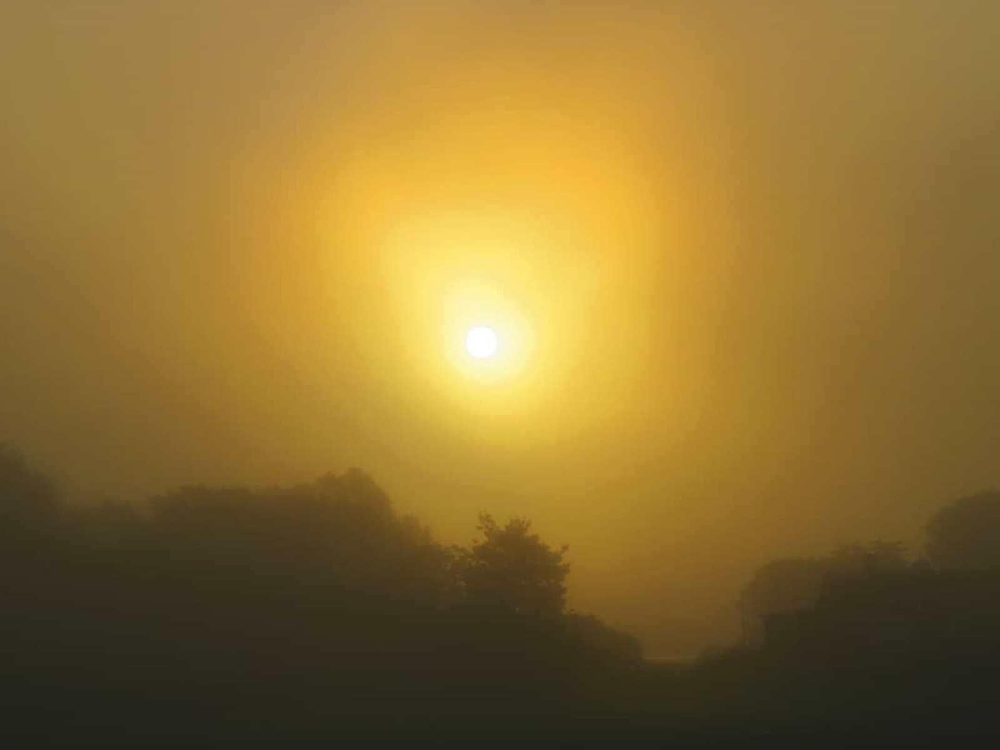

## _**Hungriga ungar och väl dolda sångare**_

Det var vad jag stötte på på min skogspromenad igår.

\[gallery type="rectangular" link="file" size="large" ids="36175,36176,36177,36178,36179,36180,36181"\]

\[gallery type="rectangular" link="file" size="large" ids="36185,36184,36183,36182"\]

## _**Och sen en dimmig morgon på jobbet**_

så fick jag se dessa rådjur som lugnt gick och betade utan att bry sig särskilt mycket om mig

\[gallery link="file" size="large" type="rectangular" ids="36165,36166,36167,36168,36169,36170"\]

## _**Lite längre fram fick jag syn på den är lilla figuren som knappt syntes i dimman**_

En mindre flugsnappare satt nästan ända framme vid bilen på en stolpe. Men självklart flög den längre bort lagom tills jag fick upp kameran. Men skam den som ger sig! Några dimmiga bilder fick jag i alla fall.

\[gallery type="rectangular" link="file" size="large" ids="36174,36173,36172"\]

## _**Och sist...**_

en dimmig soluppgång

