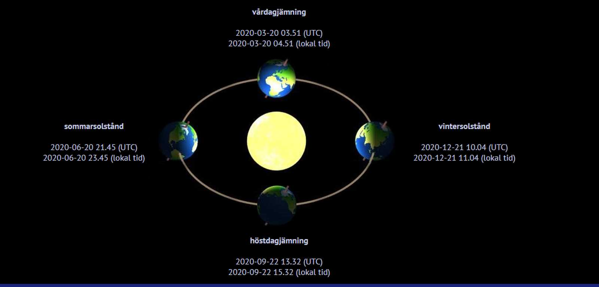
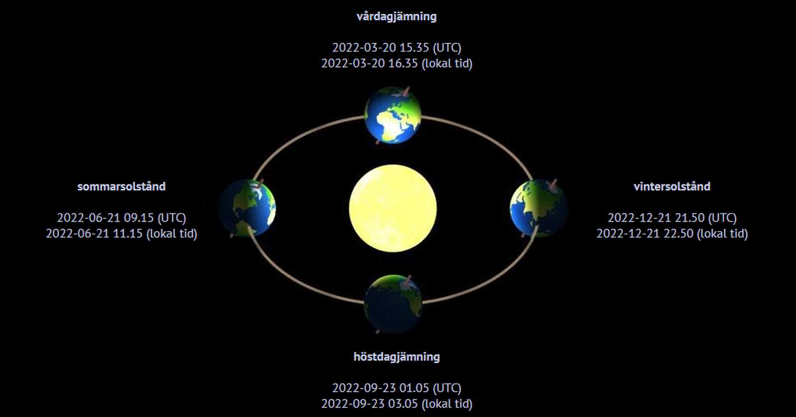

## _**Vintersolstånd 2020**_

Äntligen kan man börja se ljuset i tunneln igen! Åtminstone när det gäller det bokstavliga ljuset. För nu blir det inte mörkare än så här när vintersolståndet gör att vi vänder åt rätt håll igen. Vi får även hoppas att det blir ljusare tider på andra sätt och att pandemin lugnar ner sig snart!

Under coronaåret 2020 ligger det nära till hands att fokusera på att vintersolståndet innebär en mörk tid, den mörkaste under året.

Antalet soltimmar är försvinnande få, solen står som lägst på himlen sett från norra halvklotet och norr om polcirkeln råder polarnatt: solen går inte upp alls. I Kiruna är det polarnatt från 12 till 31 december.

För den som vill se den positiva sidan betyder vintersolståndet att vi sedan dag för dag går mot ljusare tider och att dagarna blir längre.

## _**När infaller vintersolståndet?**_

2020 infaller vintersolståndet måndag den 21 december klockan 11.02.

## _**Årets kortaste dag 2020**_

Varför blir det då så här?

Det hänger ihop med att jordens rotationsaxel lutar i förhållande till solen, vilket skapar årstiderna. När den axeln lutar som mest bort från solen står solen som lägst på himlen, och dagen blir alltså som kortast.

## _**Vintersolståndet – så firades det**_

I förkristna tider hade vintersolståndet stor kulturell betydelse, och firandet av julen hade ursprungligen en koppling till vintersolståndet.

I det romerska riket firade man vinterhögtiden Saturnalia i anslutning till vintersolståndet, och här i Norden hade vi offerriten Midvinterblot, som senare kom att kallas jólablot.

Det var en föregångare till ”juldrickandet”, det hedniska julfirandet som sedermera slogs ihop med det kristna högtidsfirandet.

## _**Årets ljusaste dag 2021**_

Det vi har att se fram emot är att sommarsolståndet kommer inträffa måndag den 21 juni. Fram till dess blir det bara ljusare och ljusare och ljusare.

Källa: [Lars Lindström Expressen](https://www.expressen.se/nyheter/vintersolstandet-2020-da-infaller-arets-langsta-natt/)

Tiderna för 2020

Tiderna för 2021

Tiderna för 2022

[Här](http://btsdata.se/pages/astronomy/equisol.php) kan du se tiderna för flera år framöver.
