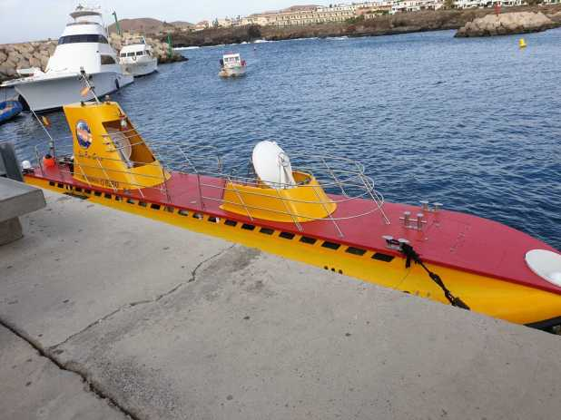

## _**Med ubåt 30 meter ner i djupet på Teneriffa!**_

Det här är något av det häftigaste vi har gjort på våra resor. Vi åkte 30 meter ner i djupet och fick se massor av fiskar, rockor och skeppsvrak! Jag hade kunnat sitta där hur länge som helst och bara njutit av fiskarna och lugnet där nere. Här får ni se lite av det vi fick se när vi var ute på djupt vatten!

  

https://www.youtube.com/watch?v=wBsSLcsc7VM
