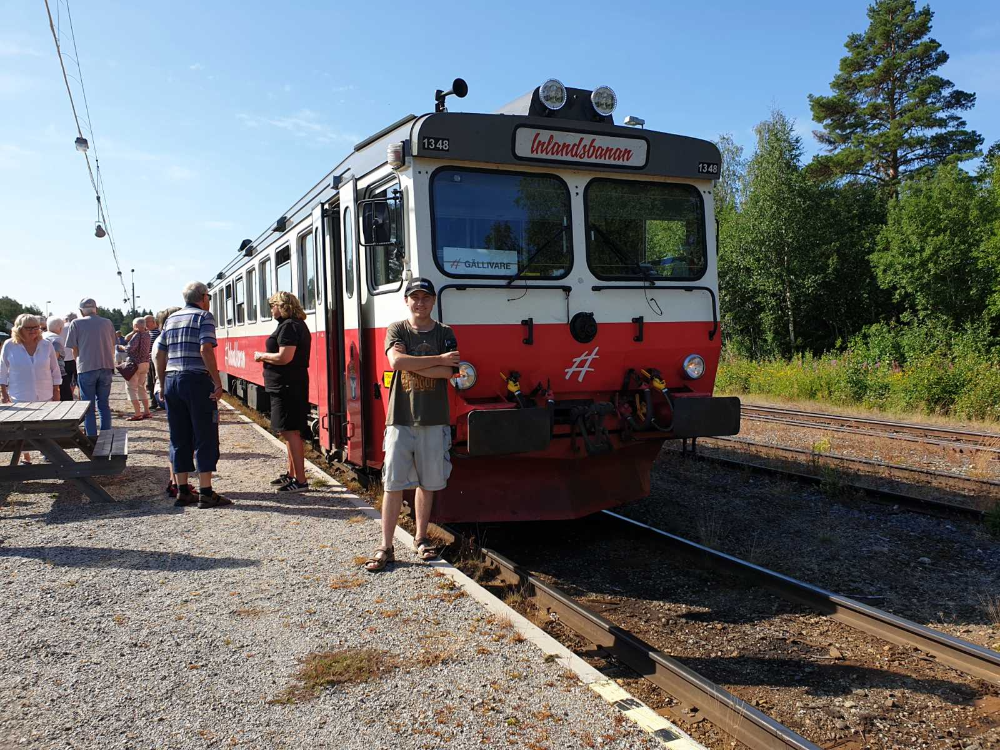

## _**Dag 3**_

 Johannes gör sig redo för 13 timmar på räls!

På den tredje dagen var det dags för en lång resa med Inlandsbanan. Och den skulle visa sig bli mer händelserik än vi kunnat ana! Allt började bra när vi klev på tåget i Östersund och började vår 13 timmar långa färd upp till Gällivare. Det är ju inget lyxtåg direkt så bekvämligheten var inte femstjärnig kan man säga. Men det är ju det som är lite grejen med Inlandstågen. Man ska få lite känsla av hur det var förr, innan X2000 och andra moderna tåg tog över. Det finns ingen luftkonditionering på de här tågen och med tanke på att vi hade strålande sol och bitvis upp mot 30 grader varmt under resan så kan jag lova att det var svettigt värre! Det gick visserligen att öppna fönstren men flera av våra medpassagerare var inte bekväma med tvärdrag så vi fick vackert härda ut i värmen. Efter en kort tid så upptäcktes det att toaletten på tåget inte fungerade och 13 timmar utan toa kändes inte som en bra idé. Så kloka hjärnor slogs ihop och försökte komma på en lösning men ingenting hjälpte. Så vid nästa stopp fick vi byta tåg. Den här gången fick vi ett vitt tåg istället för det vanliga röda. Nu trodde man att allt var frid och fröjd! Men icke då! Det första problemet var av mindre allvarlig natur men ändå ganska irriterande med tanke på att det var en guidad tur vi åkte med. Mikrofonen visade sig inte fungera i det nya tåget! Så guiden fick använda stämbanden istället och gå runt och upprepa sig för att alla skulle höra vad hon sa. Till min förtret upptäckte jag att mitt säte var bakåtfällt i nästan liggande ställning och gick inte att fälla upp! Så jag fick byta med Jonas om jag ville men då fick jag solen i ögonen hela tiden. Det hade jag för övrigt haft i stort sett hela vägen ändå så det kunde kvitta. I Sorsele var det så dags för ett kort stopp för lite mat och sedan vidare igen. Trodde vi! Men ack så vi bedrog oss! När vi intet ont anande satt och åt så fick vi veta att tåget gått sönder! Och att det skulle ta minst tjugo minuter innan det kom en reparatör till vischan vi var på! Så det var bara att gilla läget och försöka hitta på ett sätt att få tiden att gå i den stekheta värmen. Till slut hittade vi en liten shop med souvenirer och en helt underbar luftkonditionering!!! Jag parkerade mig under den och stod och njöt i fulla drag av den härligt svala luften en lång stund. Efter ungefär en halvtimme och en glass senare så var det dags att kliva på tåget igen och att börja svettas efter den sköna svalkan i shoppen. Resan gick vidare genom skog och mark och älvar och sjöar och vidunderligt vacker natur. Vi fick se några älgar som sprang in i skogen och två vita renar som också flydde iväg när de såg oss komma dundrande. Men det var också en hel del dumma människor som gick på rälsen och skrämde livet ur oss när lokföraren fick lägga sig på tutan för att uppmärksamma dem på hur olämpligt det var att promenera där! Det hände flera gånger tyvärr. Men nog med text nu. Här kommer lite bilder från vår händelserika tågresa genom Norrland, från Östersund till Gällivare!

Eftersom jag mest filmade så har jag tyvärr inte så många bilder som jag önskat men de jag har kan ni se ett urval av här.

 

\[gallery type="rectangular" link="file" size="large" ids="40592,40590,40591,40593"\]

\[gallery type="rectangular" link="file" size="large" ids="40594,40595,40597"\]

\[gallery type="rectangular" link="file" size="large" ids="40598,40639,40599,40638,40600,40601,40602,40603,40604,40605,40606,40636,40607"\]

\[gallery type="rectangular" link="file" size="large" ids="40608,40609,40610,40611,40612,40613,40614,40615,40616"\]

\[gallery type="rectangular" link="file" size="large" ids="40618,40619,40617,40620,40621"\]

\[gallery type="rectangular" link="file" size="large" ids="40627,40626,40625,40624,40623,40622"\]

\[gallery type="rectangular" link="file" size="large" ids="40629,40628,40645,40647"\]

\[gallery type="rectangular" link="file" size="large" ids="40630,40632,40631"\]

\[gallery type="rectangular" link="file" size="large" ids="40634,40633,40635"\]

https://www.youtube.com/watch?v=sa5MZFGytqg

Här är ett litet smakprov från vår tur med Inlandsbanan.
