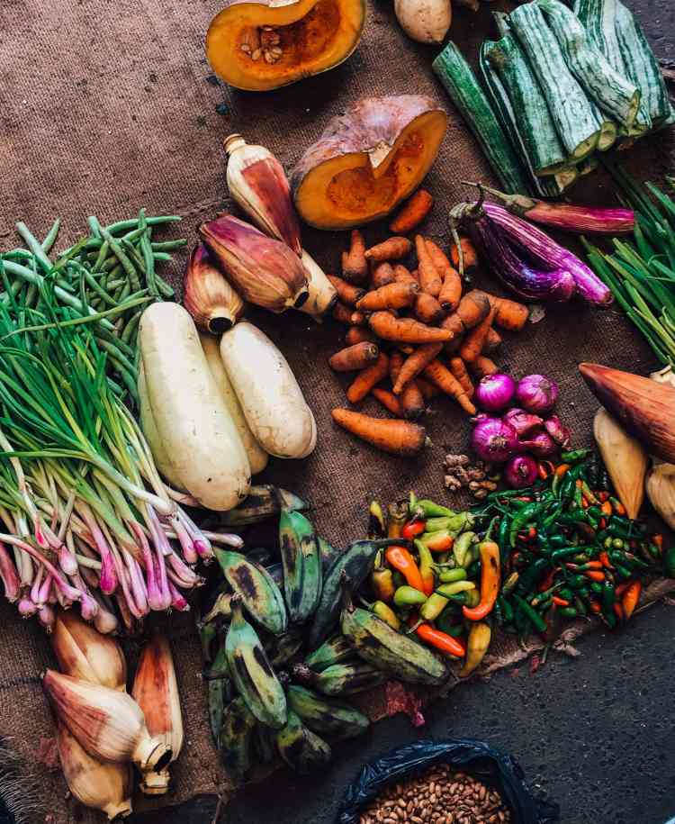
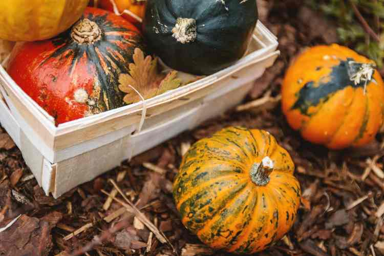
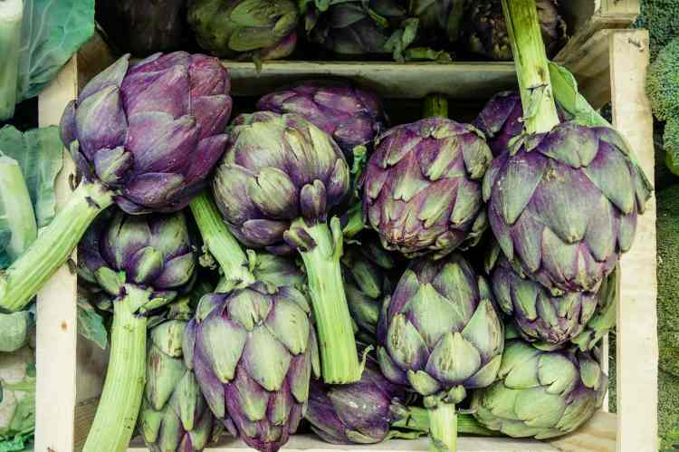
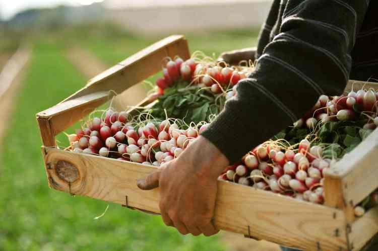
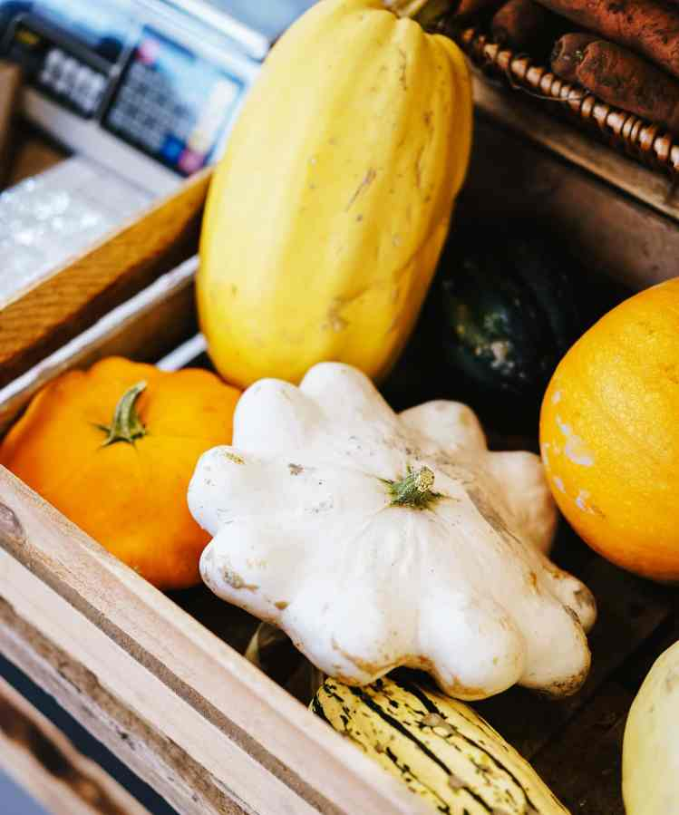

# Locally Farmed Organic Vegetable Delivery

20 years of growing organic vegetables and delivering vegetable boxes from our 12-acre farm in Sussex.

[Get in touch](/contact)

**Services**

## What We Do

* * *

We produce organic vegetable boxes that are affordable, seasonal, and as fresh and local as possible.

We have different sizes of boxes available for various appetites, from individuals to families.

We are flexible with the items in your boxes. You can change items in your order for something you would like.

**Meet us better**

## Our Organic Farm in Numbers

* * *

## **370**

households per month

## **23**

experts working

## **5**

awards won

## **100%**

satisfied customers

### Why You'll Love Us

There is never been a better time to eat organic. Organic means working with nature. We’re coming into a fantastic time for European food.

- **Delicious**
- **Ethical**
- **Sustainable**
- **Seasonal**
- **Free delivery**

★★★★★

**"Excellent Service"**

Their service is brilliant! I really hope some of them are now using your service.

**Fiona**

★★★★★

**"Love the flexibility"**

We are very happy with the box and we value that we can have the standard box or choose our own.

**Joseph**

★★★★

**"Fantastic quality"**

I'm really appreciating the quality and presentation. The flavour of the veg is outstanding.

**Michelle**

**Try with our vegetables**

### Our Favourite Recipes

* * *

[More Recipes](/recipes)
