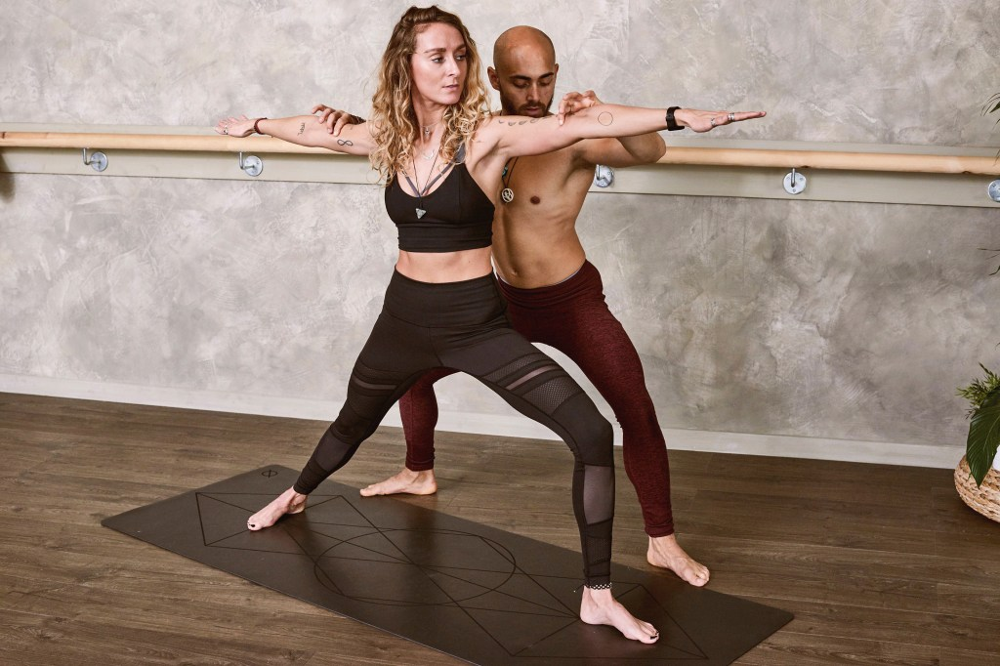
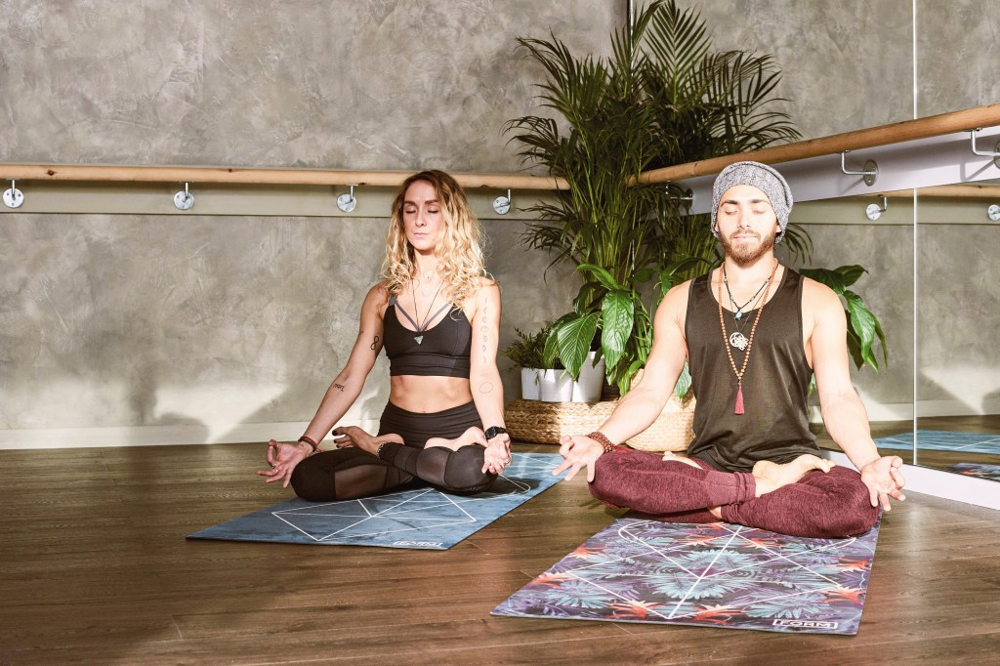
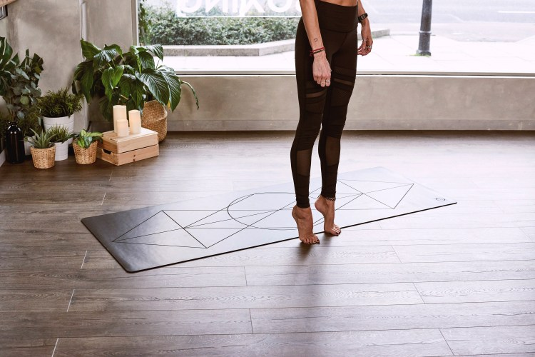

# We are Bālāsana, a yoga studio based in Brooklyn, NY.

In our beautiful studio, learn from our workshops, restore your body and soul with our classes, and feel better about yourself.

#### Our Classes

The studio runs daily classes, where all levels are welcome. But if you’re a total beginner then we offer basic classes to help you find the confidence you need to get to know your body.

[View Classes](https://balasanademo.wordpress.com/classes/)

**For more general information on getting started and yoga as a lifestyle, please visit our blog.**

[View Blog](https://balasanademo.wordpress.com/blog/)

#### Our Teachers

Our instructors are all different, with diverse lives, styles and backgrounds but what is consistent is that all of them are kind, committed and inspirational.

[View Teachers](https://balasanademo.wordpress.com/teachers/)

###### Discovery Pass (Best Value)

**$50**

3 weeks validity

[Read More](https://balasanademo.wordpress.com/classes/)

###### Complete Beginners Course

**$75**

4-week course

[Read More](https://balasanademo.wordpress.com/classes/)

###### Barre Intensity Course

**$90**

4-week course

[Read More](https://balasanademo.wordpress.com/classes/)

## Bālāsana

Founded in 2015 by Joan Smith, Bālāsana, is a renowned yoga studio based in Brooklyn, NY.

Do you have questions about our yoga studio or the yoga classes we offer here?

[email@domain.com](mailto:email@domain.com)

[(123) 456-7890](tel:1234567890)

[99 Wythe AvenueBrooklyn, NY 11249](https://www.google.com/maps/search/99+Wythe Avenue,+Brooklyn,+NY,+11249 "Open address in Google Maps")
