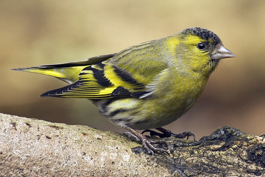

**Grönsiska, Siskin** ( Carduelis spinus )

_Grönsiskan är en liten fågel med kort huvud och kort kluven stjärt.Den är gulgrön med svarta tecken och tydliga mörkt inramade gula eller gulvita vingband. Hannen har svart hjässa och haklapp._

_Honan har grågrön mörkstreckad hjässa och bröst. Grönsiskan äter gärna vid fågelbord på senvintern. Häckar i barr och blandskog i hela Sverige. Äter frön från bl.a.gran björk och al. _Den flyttar sent i december men stannar under år med god födotillgång. Boet är en skål av tunna grangrenar._ Mycket roligt att få besök av denna lilla fågel. Längd: 12-13 cm. Vingspann: 20-23 cm. Vikt: 12 gram. Livslängd: Upp till 13 år._

Bilder [Falknatur](http://www.falknatur.se/arter/gronsiska.htm) Bilder [Vingspann](//www.vingspann.se/gronsiska1.htm) Grönsiska bilder och läte

https://www.youtube.com/watch?v=aAkLVBxj8k8 Grönsiska film

Vi ses imorgon igen i denna spalt
