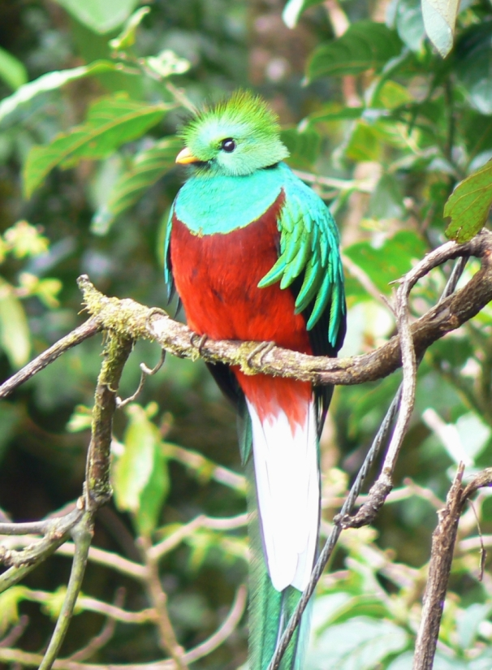

**Praktquetzal** ( Pharomachrus mocinno )

_Hanarnas regnbågsskimrande stjärtfjädrar, som kan tyckas extravaganta, kan vara hela 90 cm långa. Hanens huvud, hals, övre delen av bröstet, rygg och fjädrar är metalliskt gröna medan nedre delen av bröstet samt hela magen är djupröd. Hanen har en distinktiv, upprättstående borstig tofs av gyllene gröna fjädrar som formar en "tuppkam" på toppen av huvudet. Praktquetzalhonan är ganska lik hanen gällande fjäderdräkstens färg med undantag av att det är mindre iögonfallande än hanens. Honans huvud varierar från grått till brons med grön färg på topparna. Bröstet är ibland grå eller en dämpad nyans av röd. Oftast är hanens lysande gröna färg ersatt av brun och brungul färg hos honorna_. _De har olivgröna fötter med fyra tår i varje fot (två fram och två bak). Den första och den andra tån är lokaliserade på baksidan medan den tredje och den fjärde tån är riktade framåt. Detta gör deras fötter väldigt svaga samt första och andra tån orörliga._ _Praktquetzalens näbb är ganska kort men fortfarande väldigt stark. Hanens näbb är gul medan honans är svart. Honor och hanar använder deras korta näbbar huvudsakligen till häckning och till gnagande._ _Quetzaler häckar i hålor och använder sina näbbar till att gräva hål i bark. De fyller inte boet med bomaterial utan lägger sina ägg, vanligen två, direkt på det bara underlaget av boet. Maten består främst av frukt,helst avokado,men den kan även äta insekter,små grodor och ödlor._ _Längd: 35 cm plus stjärt 90 cm på hannar. Vingspann: Ingen uppgift. Vikt: 210 gram. Livslängd: Ingen uppgift._

https://www.youtube.com/watch?v=BrXjCoJXieE https://www.youtube.com/watch?v=k5TTb6FxITs https://www.youtube.com/watch?v=zW7RJuloa8M https://www.youtube.com/watch?v=T3W0km48pEo Praktquetzal filmer

Ny fågel på onsdag
