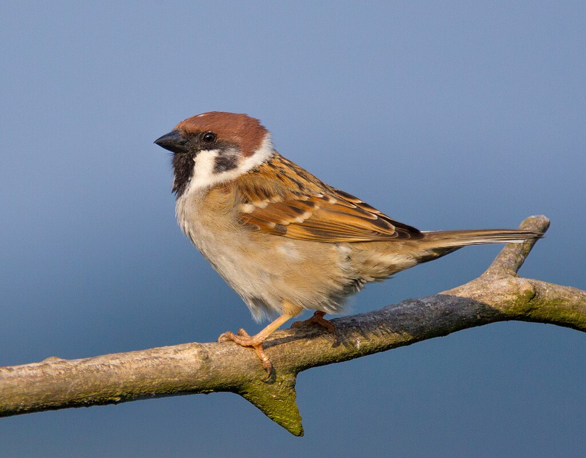

**Pilfink, Tree Sparrow** (Passer montanus)

_Pilfinken är en "pratig och tjattrig" liten fågel som är en flitig gäst vid fågelbordet.Hanne och hona ser likadana ut.De har enfärgat brunt huvud,vita kinder,liten svart haklapp och en svart fläck på kinden bakom ögat. Den har tydligt vitt vingband. Den tycker om ogräsfrön och spillsäd och på sommaren även insekter och spindlar. Den är ganska lik gråsparven men främst kindpricken gör den lätt att skilja från sparven. Trevlig liten gäst vid matbordet. Kommer ofta i stora flockar. Längd: 12-14 cm. Vingspann: Ca.21 cm. Vikt: 24 gram. Livslängd: Upp till 13 år och 1 månad._

Bilder [Falknatur](http://www.falknatur.se/arter/pilfink.htm) Bilder [Vingspann](http://www.vingspann.se/pilfink1.htm) Bilder [Lars Lundmark](http://www.larslundmark.se/pilfink.php) Pilfink bilder och läte

https://www.youtube.com/watch?v=lR6eTiL\_nWk

https://www.youtube.com/watch?v=UhWrJVFCvHo

https://www.youtube.com/watch?v=LpfR5qviqb8 Pilfink filmer.

Bilder Wikipedia. Filmer Youtube.
