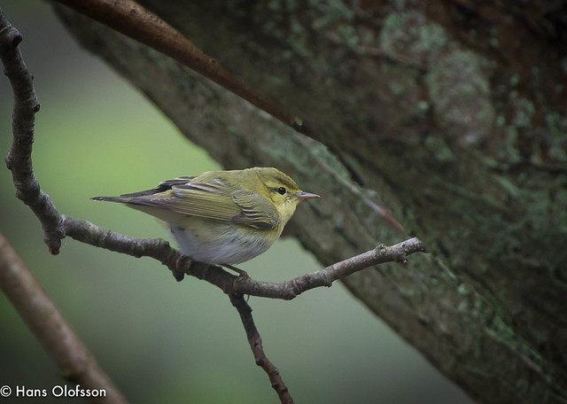

**Grönsångare, Wood Warbler** ( Phylloscopus sibilatrix )

_Grönsångaren är en liten fågel som är citrongul på bröstet och har ögonbrynsstreck och strupe i gult.Ovansidan är grön. Den har rent vit undersida.Den har längre vingar,klarare färger och kortare stjärt än gransångare och lövsångare. Grönsångaren häckar i stora delar av Europa och österut till Uralbergen. Den är en flyttfågel och övervintrar i tropiska Afrika. Den anländer i April-Maj till Sverige,mest i söder, och flyttar i Juli- Augusti. Den häckar i högtsammig lövskog i södra och mellersta Sverige.Även i parkanläggningar.Boet är bakugnsformat och byggs av strån och gräs och göms i busksnår på marken. Den tycker om spindlar,blötdjur,bär insekter och larver. En söt liten filur som jag aldrig har haft äran att få till fågelbordet ännu. Längd: 11-13 cm. Vingspann: 19-24 cm. Vikt: 8-13 gram. Livslängd: Upp till 8 år och 10 månader._

Bilder [Falknatur](http://www.falknatur.se/arter/groensangarel.htm) Bilder [Vingspann](http://www.vingspann.se/gronsangare1.htm) Grönsångare läte och bilder.

https://www.youtube.com/watch?v=Vr2ZV0OpKeA Grönsångare film

Vi ses vid fågelbordet imorgon igen.
