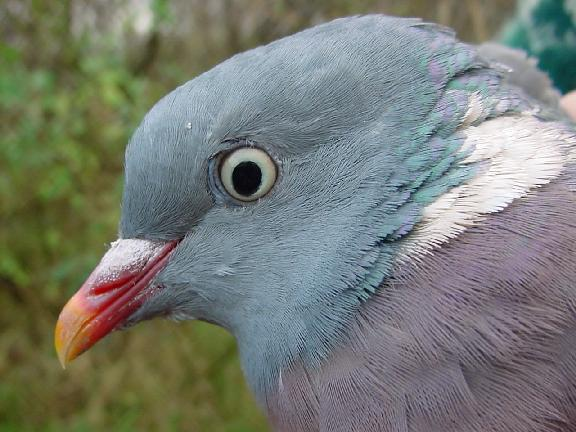

**Ringduva, Wood Pigeon** ( Columba palumbus )

__

__

__

__

 _ Ringduvan är den största av alla duvor. Den känn igen på sina stora vita vingfält.Gamla fåglar har även en vit halsfläck. Fjäderdräkten är mest grå med grönblåskimrande inslag främst på huvud och nacke. Stjärt och vingar har tydliga svarta markeringar och bröstet är rosafärgat som övergår i ljusgrått  på undersidan.Den har vita fläckar på halsens sidor. Den vuxna duvan har gula ögon och_ _gulorange_ _näbb.Den flyger upp och landar med kraftiga vingslag. Den häckar i skog,parker och trädgårdar i hela Sverige.Den är en flyttfågel som främst övervintrar i Västeuropa. Den mumsar på frön,bär,ekollon och bokollon.Den syns ofta i stora flockar.Den bygger ett enkelt risbo i  träd och buskar. Längd: 45 cm. Vingspann: 65-80 cm. Vikt: 400-550 gram. Livslängd: Upp till 15 år._

Bilder [Falknatur](http://http://www.falknatur.se/arter/ringduva.htm) Bilder [Vingspann](http://www.vingspann.se/ringduva1.htm) Ringduva bilder och läte

https://www.youtube.com/watch?v=abg42f18AlE Ringduva film

Ny fågel flyger förbi imorgon
