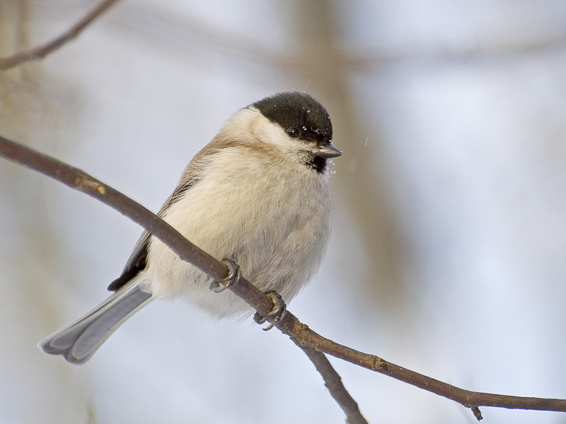

**Entita**

_Som ni ser så är den här lilla filuren väldigt lik sin släkting Talltitan som var dagens fågel igår. Entitan har glänsande svart hjässa,enfärgad brun rygg,ljust gråbeige undersida och vit kind.Den besöker ofta fågelborden och jag har turen att få besök av två stycken nästan varje dag.Den är en stannfågel i södra och mellersta Sverige. En utpräglad lövskogsmes som äter främst insekter sommartid och resten av året även frön bokollon och bär.Häckar i ihåliga träd och holkar. Längd:11-13 cm. Vingspann: 18-20 cm. Vikt: 11 gram._ Bilder [Falknatur](http://www.falknatur.se/arter/entita.htm) Bilder [Vingspann](http://www.vingspann.se/entita1.htm) Entita läte och bilder.

http://www.youtube.com/watch?v=KdP07CpE3J0 Entita film.

Vi ses imorgon igen vid fågelbordet.
