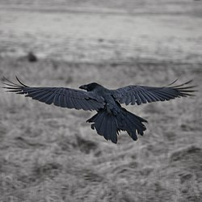

**Korp** ( Corvus corax )

_Korpen är den största kråkfågeln i Europa. Den är jämnstor med ormvråken. Den har stort huvud och mycket kraftig näbb och i flykten syns långa vingar med tydliga fingrar,kilformad stjärt och ett långt framåtsträckt huvud. Den häckar i hela Sverige,framförallt i skogsdominerade delar,men även i större dungar i jordbrukslandskap.Den har återhämtat sig kraftigt under 1900-talet.Den är en stannfågel.och den är allätare och äter främst avfall och kadaver.Den äter även levande smådäggdjur,fågelungar,fåglar,ägg,insekter och bär.Den bygger ett stort risbo i ett träd eller ett klippstup. Den här typen av fåglar får ofta bära rollen som skurkar och skumma typer i tecknade filmer. Det finns nog ett visst fog för detta eftersom korpen är en mycket smart fågel._ _Längd: 54-67 cm. Vingspann: 115-130 cm. Vikt: 700-1600 gram._ _Livslängd:_ _10-15 år. Vid Towern har vissa blivit 40 år._ _Texten nedan är klippt ur wikipedias beskrivning av korpen. Den är väldigt intressant._

### Intelligens

_Korpar har bland de största hjärnorna av alla fågelarter. Liksom hos andra kråkfåglar finns anekdotiska observationer av anmärkningsvärda bedrifter i fråga om problemlösning, vilket har lett till uppfattningen att fåglarna har hög intelligens. Vetenskapsmännen är dock osäkra på omfattningen av deras andra kognitiva processer, såsom imitation och insikt[.](http://sv.wikipedia.org/wiki/Korp#cite_note-birdinblack-48)_

_Ett experiment som utformades för att utvärdera insikts- och problemlösningsförmåga involverade en bit kött som var fäst vid ett snöre som hängde från en pinne. För att nå maten behövde fågeln stå på pinnen, dra upp snöret en bit i taget och ställa sig på öglorna för att gradvis förkorta snöret. Fyra av fem korpar lyckades så småningom och "övergången från ingen framgång (att strunta i maten eller enbart rycka i snöret) till konstant pålitlig tillgång (att dra upp köttbiten) skedde utan någon påvisbar "trial and error-inlärning"._

_Man har observerat att korpar har manipulerat andra till att utföra arbeten åt dem, som att locka vargar och prärievargar till platsen för döda djur. Hunddjuren öppnar kadavret och gör det därmed lättare tillgängligt för fåglarna. De ser efter var andra korpar gömmer sin föda och kommer ihåg var de har placerat sina födogömmor, så att de kan stjäla från dem. Sådana matstölder sker så ofta att korpar flyger extra långa avstånd från födokällor för att hitta bättre gömställen för maten. Man har också observerat korpar som har låtsats göra ett gömställe utan att faktiskt lägga maten där, förmodligen för att förvirra åskådare._

_Korpar är kända för att stjäla och gömma glänsande föremål som småstenar, metallbitar, silverskedar från trädgårdsbord, örhängen och golfbollar. En teori är att de samlar på sig glänsande föremål för att imponera på andra korpar. Annan forskning tyder på att ungfåglar är mycket nyfikna på alla nya saker, och att korpar fortsätter att vara lockade av ljusa, runda föremål på grund av deras likhet med fågelägg. Adulta fåglar förlorar dock intresset för ovanliga saker och blir istället neofobiska, det vill säga, mycket avvaktande inför okända ting._

_Under senare år har biologer börjat inse att fåglar ägnar sig åt lek. Juvenila korpar är bland de mest lekfulla av alla fågelarter. De har observerats glida ned för snödrivor, till synes enbart för nöjes skull. De leker till och med tillsammans med andra arter, som att leka "fånga mig om du kan" med vargar och hundar. Korpar är kända för spektakulära akrobatiska uppvisningar, som att flyga i loopar._

Bilder [Falknatur](http://www.falknatur.se/arter/korp.htm) Bilder [Vingspann](http://www.vingspann.se/korp1.htm) Korp bilder och läte

https://www.youtube.com/watch?v=YnUT1J-1sec https://www.youtube.com/watch?v=DDmCxUncIyc Korp filmer som visar hur smarta de är

Imorgon kommer en ny fågel förbi bloggen
