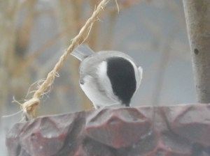
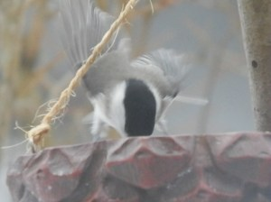
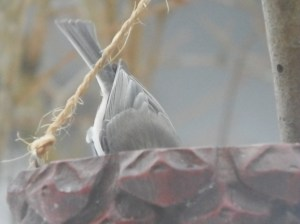
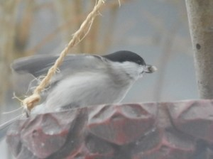
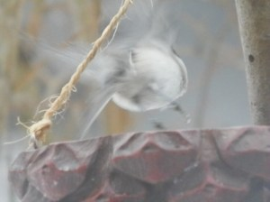

**Entita hittar godis**

 _Hmm Vad finns det här då?_

 _Bäst att dyka ner och kolla!_

 _Ojojoj vad smaskens.Bäst att förse sig_ _snabbt_

 _Det här var ett riktigt fynd._

 _Bäst jag sticker innan någon annan får _ögonen_ på den._

 _Adios!_

 _Och goodbye!_

Det är en evig kamp om brödfödan varje dag.
