_Här skulle jag vilja visa hur det ser ut kring "matbordet" hemma i min trädgård. Ibland lyckas vi locka till oss riktigt fint besök och ibland kommer bara "medelsvensson" och smakar på läckerheterna.Men inte alla har vingar som äter här. Håll tillgodo._

[![2013-08-17 20.47.59 [1024x768]](images/2013-08-17-20-47-59-1024x768.jpg)](http://worldwideweatherblog.wordpress.com/wp-content/uploads/2014/03/2013-08-17-20-47-59-1024x768.jpg) Maka på dig.Jag vill också smaka.

[![2013-08-18 20.29.39 [1024x768]](images/2013-08-18-20-29-39-1024x768.jpg)](http://worldwideweatherblog.wordpress.com/wp-content/uploads/2014/03/2013-08-18-20-29-39-1024x768.jpg) Sådärja,det här var gott.

[![2013-08-17 20.48.05 [1024x768]](images/2013-08-17-20-48-05-1024x768.jpg)](http://worldwideweatherblog.wordpress.com/wp-content/uploads/2014/03/2013-08-17-20-48-05-1024x768.jpg) Okej,du får väl också smaka då...

[![2013-08-18 20.30.36 [1024x768]](images/2013-08-18-20-30-36-1024x768.jpg)](http://worldwideweatherblog.wordpress.com/wp-content/uploads/2014/03/2013-08-18-20-30-36-1024x768.jpg) men du behöver väl inte ta allt.

[![2013-08-03 15.12.08 [1024x768]](images/2013-08-03-15-12-08-1024x768.jpg)](http://worldwideweatherblog.wordpress.com/wp-content/uploads/2014/03/2013-08-03-15-12-08-1024x768.jpg) [![2013-08-03 14.43.39 [1024x768]](images/2013-08-03-14-43-39-1024x768-e1395070226360.jpg)](http://worldwideweatherblog.wordpress.com/wp-content/uploads/2014/03/2013-08-03-14-43-39-1024x768-e1395070226360.jpg) Pärlemorfjäril som gillar min Buddlejabuske.

[![2013-08-10 15.43.49 [1024x768]](images/2013-08-10-15-43-49-1024x768.jpg)](http://worldwideweatherblog.wordpress.com/wp-content/uploads/2014/03/2013-08-10-15-43-49-1024x768.jpg) Nässelfjäril och....

[![2013-08-03 14.43.00 [1024x768]](images/2013-08-03-14-43-00-1024x768.jpg)](http://worldwideweatherblog.wordpress.com/wp-content/uploads/2014/03/2013-08-03-14-43-00-1024x768.jpg) Påfågelsöga.

 [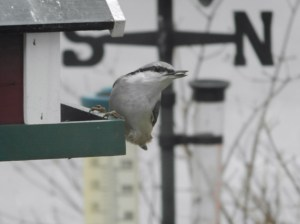](http://worldwideweatherblog.wordpress.com/wp-content/uploads/2014/03/pb010333-1024x768.jpg) Mums vad gott!

[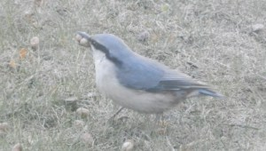](http://worldwideweatherblog.wordpress.com/wp-content/uploads/2014/03/p4190010-1024x768-e1395070865767.jpg) Men hallå! Vad glor du på? Det är väl inte för inte som jag kallas nötväcka.

[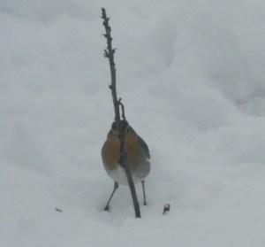](http://worldwideweatherblog.wordpress.com/wp-content/uploads/2014/03/p2200016-1024x768-e1395071159500.jpg) Tittut!

 Erkänn! Du såg mig inte första gången.

[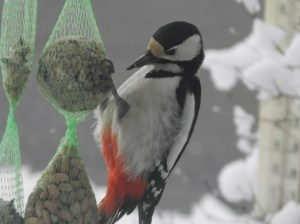](http://worldwideweatherblog.wordpress.com/wp-content/uploads/2014/03/p2190512-1024x7681.jpg) [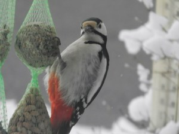](http://worldwideweatherblog.wordpress.com/wp-content/uploads/2014/03/p2190511-1024x768.jpg) Hacke vill gärna vara med på ett hörn också.

[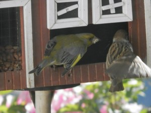](http://worldwideweatherblog.wordpress.com/wp-content/uploads/2014/03/p6180474-1024x768.jpg) Hallå!!! Vad pysslar du med? Det här är mitt bord.

 Schas väck med dig!

[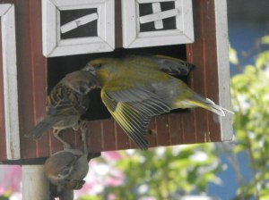](http://worldwideweatherblog.wordpress.com/wp-content/uploads/2014/03/p6180468-1024x768.jpg) Och ni med! Bort med er.

 Sådärja.Grönfinken vill vara ensam herre på täppan

[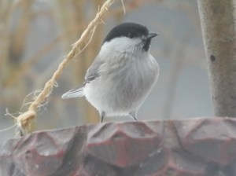](http://worldwideweatherblog.wordpress.com/wp-content/uploads/2014/03/p2060443-1024x768.jpg) [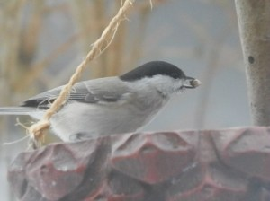](http://worldwideweatherblog.wordpress.com/wp-content/uploads/2014/03/p2060461-1024x768.jpg) Entitan har hittat godis i skålen idag.

 Grönsiskan och Pilfinken njuter av sommaren.

 Blir det bra så här?

[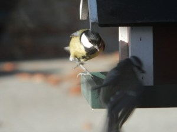](http://worldwideweatherblog.wordpress.com/wp-content/uploads/2014/03/pa281255-1024x768.jpg) Talgoxen och Blåmesen förser sig med mat.

 Hu det är kallt på vintern.

 [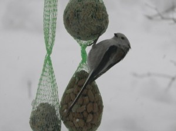](http://worldwideweatherblog.wordpress.com/wp-content/uploads/2014/03/p2190530-1024x768.jpg) Stjärtmesar som plötsligt kom på besök och försvann lika snabbt igen. Men söta var de verkligen.

[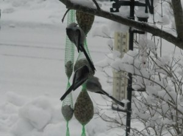](http://worldwideweatherblog.wordpress.com/wp-content/uploads/2014/03/p2190577-1024x768.jpg) Eller hur?

 Järnsparv och

 Sädesärla på besök.

 Här har vi riktigt fint besök.

[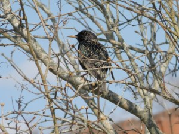](http://worldwideweatherblog.wordpress.com/wp-content/uploads/2014/03/p4100010-1024x768.jpg) Staren har anlänt.

[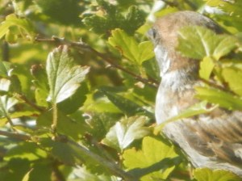](http://worldwideweatherblog.wordpress.com/wp-content/uploads/2014/03/p9030126-1024x768.jpg)  Den lilla pilfinken njuter i fulla drag av solen.

[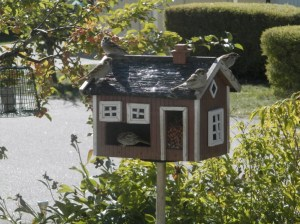](http://worldwideweatherblog.wordpress.com/wp-content/uploads/2014/03/p9030125-1024x768.jpg) Här var det fullt...

 så det är bäst att skaffa en egen gren.

[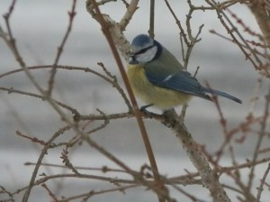](http://worldwideweatherblog.wordpress.com/wp-content/uploads/2014/03/p1230125-1024x768.jpg)  Blåmesen är en flitig,pigg och nyfiken besökare vid fågelbordet

 Jag säger till när kusten är klar...

[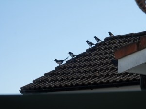](http://worldwideweatherblog.wordpress.com/wp-content/uploads/2014/03/p4050059-1024x768.jpg) på tre. Ett Två  anfall!

[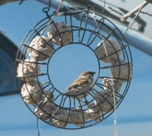](http://worldwideweatherblog.wordpress.com/wp-content/uploads/2014/03/p4140136-1024x768-e1395073289728.jpg) Inte illa! Här är man omgiven av mat!

[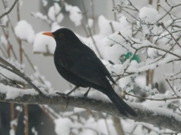](http://worldwideweatherblog.wordpress.com/wp-content/uploads/2014/03/p2190449-1024x768.jpg) Burrr och jag av snö! Orättvist.

[![2013-09-10 07.35.59 [1024x768]](images/2013-09-10-07-35-59-1024x768.jpg)](http://worldwideweatherblog.wordpress.com/wp-content/uploads/2014/03/2013-09-10-07-35-59-1024x768.jpg) Men hallå! Jag vill också vara med på ett hörn!

_Självklart får du det! Vi ses i sommar igen hoppas jag._

Hälsningar från Annelore.
