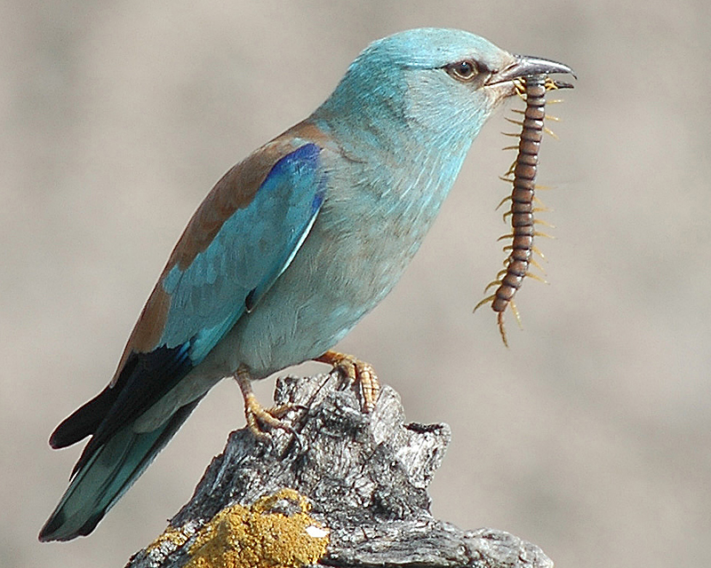

**Blåkråka, European Roller** ( Coracias garrulus )

 _Blåkråkan är stor som en kaja med stort huvud och stor näbb. Den har omisskännlig färgteckning med ljust grönblått, rödbrunt och svart. I flykten syns de svarta vingfjädrarna tydligt i det kraftigt blåa. Den häckar i torrt varmt öppet landskap med spridda träd, dungar och öppna skogar och med rikt liv av marklevande större insekter, som skalbaggar, gräshoppor m.m. I mitten av 1800-talet var blåkråkan en ganska vanlig häckfågel i södra Sverige, men redan i början av 1900-talet var den sällsynt. De sista paren häckade på Fårö 1967. Idag är arten en sällsynt gäst som man, om man har tur, kan få se även i Sverige. Även i Danmark och Tyskland har arten försvunnit som häckfågel. Liksom i Sverige beror det främst på förändringarna i jordbrukslandskapet som lett till att lämpliga häckningsplatser försvunnit. Att arten jagas på sina övervintringsplatser har också påverkat antalet fåglar. Idag finns de största populationerna i Ryssland och Turkiet. Blåkråkan återfinns från Nordafrika, genom Europa ända till Sibirien. Den bygger oftast sitt bo i trädhål. Den äter insekter, men även larver, maskar, små grodor och till och med möss._ _Längd: 29-32 cm. Vingspann: 52-57 cm. Vikt: 127-160 gram. Livslängd: Ingen uppgift._

Bilder [Falknatur](http://www.falknatur.se/arter/blakraka.htm) Bilder [Vingspann](http://www.vingspann.se/blakraka1.htm) Blåkråka bilder och läte

https://www.youtube.com/watch?v=AGeNX4SciaI https://www.youtube.com/watch?v=B1acUquNDcs https://www.youtube.com/watch?v=Fru2xmtjUcE https://www.youtube.com/watch?v=urXRIGiuG3U Blåkråka filmer

Ny fågel om en vecka.
