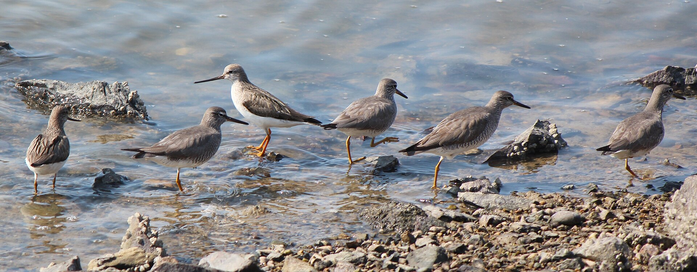

**Tereksnäppa, Terek Sandpiper** ( Xenus cinereus )

 _Tereksnäppan påminner om drillsnäppan men har en lång, klart uppåtböjd näbb. Den har brungrå rygg och vitt på vingens bakkant. Undertill är den vit fram till bröstet med svag streckning på bröst och hals. På skuldrorna finns svarta längsgående streck. Tarserna hos vuxna fåglar är orange och hos ungfåglar gula. Näbben är svart med gult i näbbroten och iris är svartbrun. Den häckar fåtaligt på Bottenhavets kuster och huvudutbredningsområdet är Eurasiens taiga från Vita havet österut. Den övervintrar östra Afrika, södra Asien och Australien. Den äter ryggradslösa djur och boet är grund grop på sandig mark, fodrat med strån, torra blad och skalbitar. Tereksnäppan ses bara tillfälligt i Sverige._ _Längd: 22-25 cm. Vingspann: 57-59 cm. Vikt: 60-78 gram. Livslängd: Upp till 16 år._

Bilder [Falknatur](http://www.falknatur.se/arter/tereksnappa.htm) Bilder [Vingspann](http://www.vingspann.se/tereksnappa1.htm) Bilder [Lars Lundmark](http://www.larslundmark.se/tereksnappa.php) Tereksnäppa bilder och läte

https://www.youtube.com/watch?v=9Z5tbmKEfzA https://www.youtube.com/watch?v=vD0KIfJ\_P2o https://www.youtube.com/watch?v=zG7Llg4kWf8 Tereksnäppa filmer

Nästa vecka kommer en ny gäst.
