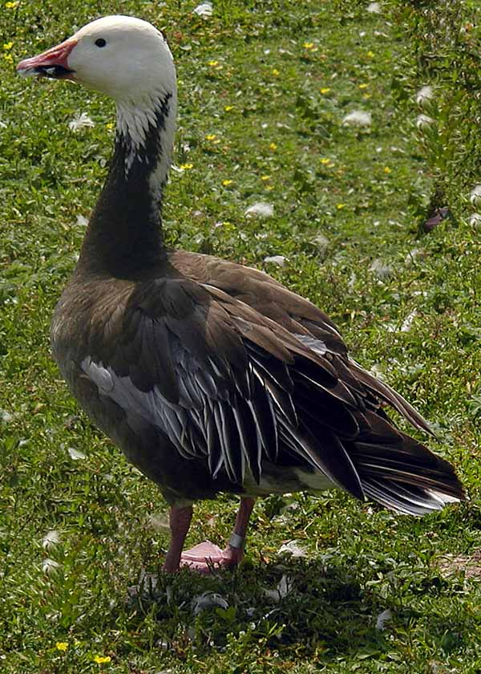

**Snögås, Snow Goose** ( Anser caerulescens )

 _Snögåsen är generellt något mindre än bläsgåsen. Den är helvit med svarta vingspetsar. Årsungarna är lite orena i dräkten med svaga brungrå teckningar. Den förekommer också i en mörk fas, blågås, vilken är mörgrå med vitt huvud och silvergrå vingtäckare. Fötter och näbb är orangerosa.  Den är en nordamerikans art som häckar på den arktiska tundran, Grönland, norra Kanada och Sibirien. Den ses väldigt sällan i Nordvästeuropa och Skandinavien. I de fall de syns i de områdena så är det i de flesta fallen förrymda parkfåglar eller utplanterade fåglar. Det kan också röra sig om genuint felflugna fåglar. I slutet av maj bygger de sitt bo på marken och boet består av lav och fjädrar. Maten består av gräs, frön och rötter. Längd: 65-78 cm. Vingspann: 130-160 cm. Vikt: 2,5-4 kg. Livslängd: Upp till över 27,5 år._

Bilder [Falknatur](http://www.falknatur.se/arter/snogas.htm) Bilder [Rolf Segerstedt](http://rolfsegerstedt.se/Fagelkryss/snogas/snogas.htm) Snögås bilder och läte

https://www.youtube.com/watch?v=9zNH9Hl\_8KI

https://www.youtube.com/watch?v=3nSuidcMiWI

Snögås filmer

Filmer från Youtube. Bilder från Wikipedia.
