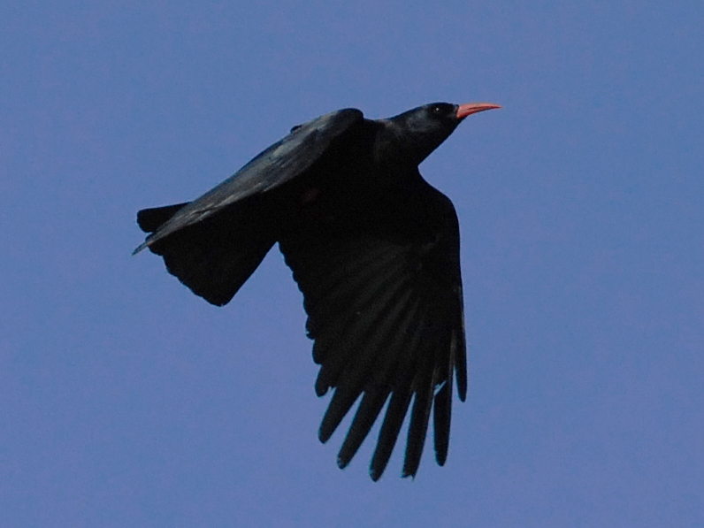

**Alpkråka, Red Billed Chuogh** ( Pyrrhocorax pyrrhocorax )

 _Alpkråkan delas upp i en mängd underarter och förekommer i Asien och i Europa på Irland, i Spanien, i Alperna strax under snögränsen samt i Etiopien i Afrika. Fjäderdräkten är svart och näbben röd på vuxna fåglar och gul på ungfågeln, benen är röda. Den föredrar kort gräs intill klippiga kuster, där den gräver efter småkryp i marken eller i djurspillning. Den häckar i klippskrevor, på klipphyllor i grottor eller ibland i förfallna byggnader och ruiner. Även i bergstrakter upp till 3000 m höjd. Ofta orädd och möjlig att komma nära. Den letar föda i små flockar och häckar i enstaka par. En skicklig flygare som gör akrobatiska flyguppvisningar i uppvindar längs klippbranter.Kan förväxlas med Alpkaja. Nedan ser du vad som skiljer dem åt. Längd: 40 cm. Vingspann: 68-80 cm. Vikt: 285-380 gram. Livslängd: Ingen uppgift._

| Kännetecken | Alpkråka | Alpkaja |
| --- | --- | --- |
| Vikt | 285–380 g | 191–244 g |
| Vinge | 249–304 mm | 250–274 mm |
| Stjärt | 126–145 mm | 150–167 mm |
| Tarser | 55–59 mm | 41–48 mm |
| Näbb | 41–56 mm | 31–37 mm |
| Näbb färg | Röd | Gul |
| Skillander i flykten: Alpkråkan har längre primära fjäder"fingrar" och kortare stjärt än Alpkajan. |  |  |

https://www.youtube.com/watch?v=\_C2wgFqrGeI

https://www.youtube.com/watch?v=9ZVFIBGZajQ

https://www.youtube.com/watch?v=mtINRDlSHZA

https://www.youtube.com/watch?v=C-S9hbMqwWE

Alpkråka filmer.

Bilder och diagram från Wikipedia. Filmer från Youtube.
